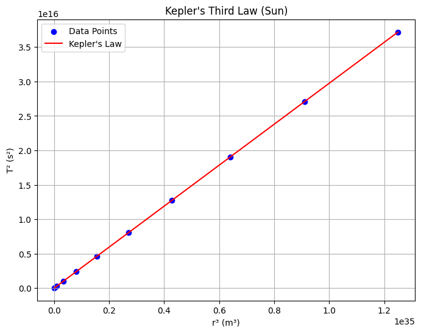
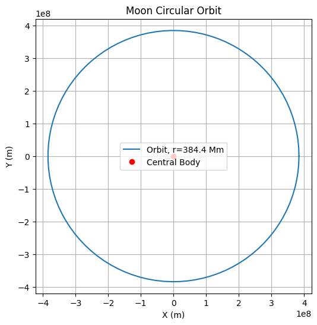

# Problem 1
Kepler's Third Law: Orbital Period and Radius Relationship
Introduction
Kepler's Third Law establishes a fundamental relationship in celestial mechanics, stating that the square of a body's orbital period ((T^2)) is proportional to the cube of its orbital radius ((r^3)) for objects in circular orbits around a central mass. This law is pivotal for understanding gravitational interactions and is widely applied in astronomy to calculate planetary masses, distances, and orbital characteristics.
Derivation of Kepler's Third Law for Circular Orbits
For a body in a circular orbit, the gravitational force provides the necessary centripetal force to maintain the orbit. Let’s derive the relationship step-by-step:

Gravitational Force: The gravitational force between the central body (mass (M)) and the orbiting body (mass (m)) is given by Newton’s law of gravitation:[F_g = \frac{G M m}{r^2}]where (G) is the gravitational constant, and (r) is the orbital radius.
$$
Centripetal Force: For a circular orbit, the centripetal force required to keep the body moving in a circle with velocity (v) is:[F_c = \frac{m v^2}{r}]

Equating Forces: Since the gravitational force provides the centripetal force:[\frac{G M m}{r^2} = \frac{m v^2}{r}]Simplifying by canceling (m) (assuming (m \neq 0)) and multiplying both sides by (r):

[\frac{G M}{r} = v^2]

Orbital Velocity: The orbital period (T) is the time taken to complete one full orbit. For a circular orbit, the circumference is (2\pi r), and the velocity is:[v = \frac{2\pi r}{T}]Squaring the velocity:[v^2 = \frac{4\pi^2 r^2}{T^2}]

Substitute Velocity: Substitute (v^2) into the force balance equation:[\frac{G M}{r} = \frac{4\pi^2 r^2}{T^2}]Multiply both sides by (T^2) and divide by (r):[\frac{G M T^2}{r} = 4\pi^2 r^2]Rearrange:[T^2 = \frac{4\pi^2 r^3}{G M}]This is Kepler’s Third Law for circular orbits, showing:[T^2 \propto r^3]The constant of proportionality is (\frac{4\pi^2}{G M}), which depends on the mass of the central body.
$$

Implications for Astronomy
Kepler’s Third Law has profound implications in astronomy:

Planetary Masses: By observing the orbital period and radius of a satellite or moon, the mass of the central body can be calculated. For example, the Moon’s orbit around Earth allows us to estimate Earth’s mass.
Distances: If the mass of the central body is known, the orbital radius of a planet or satellite can be determined from its period.
Exoplanet Detection: The law is used to infer the presence of exoplanets by observing the orbital periods of stars or their satellites.
Satellite Orbits: It aids in designing orbits for artificial satellites, ensuring they maintain stable periods and altitudes.

Real-World Examples

Moon’s Orbit Around Earth:
$$
Orbital radius: (r \approx 384,400 , \text{km} = 3.844 \times 10^8 , \text{m})
Orbital period: (T \approx 27.32 , \text{days} = 2.36 \times 10^6 , \text{s})
Earth’s mass: (M \approx 5.972 \times 10^{24} , \text{kg})
Gravitational constant: (G = 6.674 \times 10^{-11} , \text{m}^3 \text{kg}^{-1} \text{s}^{-2})
Using Kepler’s Third Law:[T^2 = \frac{4\pi^2 r^3}{G M}]Compute the right-hand side:[r^3 = (3.844 \times 10^8)^3 = 5.678 \times 10^{25} , \text{m}^3][G M = 6.674 \times 10^{-11} \times 5.972 \times 10^{24} = 3.987 \times 10^{14} , \text{m}^3 \text{s}^{-2}][\frac{4\pi^2 r^3}{G M} = \frac{4 \times (3.1416)^2 \times 5.678 \times 10^{25}}{3.987 \times 10^{14}} \approx 5.614 \times 10^{12} , \text{s}^2][T = \sqrt{5.614 \times 10^{12}} \approx 2.37 \times 10^6 , \text{s} \approx 27.43 , \text{days}]This closely matches the observed period, verifying the law.

$$
Planets in the Solar System:
$$
For planets orbiting the Sun, the constant (\frac{4\pi^2}{G M_{\text{Sun}}}) is the same. The law allows us to compare orbital radii and periods across planets, confirming the (T^2 \propto r^3) relationship.


$$
Computational Model
Below is a Python script that simulates circular orbits and verifies Kepler’s Third Law by plotting (T^2) versus (r^3). The script also visualizes a circular orbit.
```python
import numpy as np
import matplotlib.pyplot as plt

# Constants
G = 6.674e-11  # Gravitational constant (m^3 kg^-1 s^-2)
M_earth = 5.972e24  # Earth's mass (kg)
M_sun = 1.989e30  # Sun's mass (kg)

# Function to calculate orbital period
def orbital_period(r, M):
    return np.sqrt((4 * np.pi**2 * r**3) / (G * M))

# Simulate circular orbit
def plot_circular_orbit(r, title):
    theta = np.linspace(0, 2 * np.pi, 100)
    x = r * np.cos(theta)
    y = r * np.sin(theta)
    plt.figure(figsize=(6, 6))
    plt.plot(x, y, label=f'Orbit, r={r/1e6:.1f} Mm')
    plt.plot(0, 0, 'ro', label='Central Body')
    plt.xlabel('X (m)')
    plt.ylabel('Y (m)')
    plt.title(title)
    plt.legend()
    plt.grid(True)
    plt.axis('equal')
    plt.savefig(f'{title.lower().replace(" ", "_")}.png')
    plt.close()

# Verify Kepler's Third Law
def plot_kepler_law(radii, M, title, filename):
    periods = [orbital_period(r, M) for r in radii]
    T_squared = np.array(periods)**2
    r_cubed = np.array(radii)**3
    plt.figure(figsize=(8, 6))
    plt.scatter(r_cubed, T_squared, color='b', label='Data Points')
    plt.plot(r_cubed, (4 * np.pi**2 / (G * M)) * r_cubed, 'r-', label='Kepler\'s Law')
    plt.xlabel('r³ (m³)')
    plt.ylabel('T² (s²)')
    plt.title(title)
    plt.legend()
    plt.grid(True)
    plt.savefig(filename)
    plt.close()

# Parameters
r_moon = 3.844e8  # Moon's orbital radius (m)
radii_earth = np.linspace(1e8, 1e9, 10)  # Range of radii for Earth
radii_sun = np.linspace(5e10, 5e11, 10)  # Range of radii for Sun

# Generate plots
plot_circular_orbit(r_moon, 'Moon Circular Orbit')
plot_kepler_law(radii_earth, M_earth, 'Kepler\'s Third Law (Earth)', 'kepler_earth.png')
plot_kepler_law(radii_sun, M_sun, 'Kepler\'s Third Law (Sun)', 'kepler_sun.png')

# Constants
G = 6.674e-11  # Gravitational constant (m^3 kg^-1 s^-2)
M_earth = 5.972e24  # Earth's mass (kg)
M_sun = 1.989e30  # Sun's mass (kg)

# Function to calculate orbital period
def orbital_period(r, M):
    return np.sqrt((4 * np.pi**2 * r**3) / (G * M))

# Simulate circular orbit
def plot_circular_orbit(r, title):
    theta = np.linspace(0, 2 * np.pi, 100)
    x = r * np.cos(theta)
    y = r * np.sin(theta)
    plt.figure(figsize=(6, 6))
    plt.plot(x, y, label=f'Orbit, r={r/1e6:.1f} Mm')
    plt.plot(0, 0, 'ro', label='Central Body')
    plt.xlabel('X (m)')
    plt.ylabel('Y (m)')
    plt.title(title)
    plt.legend()
    plt.grid(True)
    plt.axis('equal')
    plt.savefig(f'{title.lower().replace(" ", "_")}.png')
    plt.close()

# Verify Kepler's Third Law
def plot_kepler_law(radii, M, title, filename):
    periods = [orbital_period(r, M) for r in radii]
    T_squared = np.array(periods)**2
    r_cubed = np.array(radii)**3
    plt.figure(figsize=(8, 6))
    plt.scatter(r_cubed, T_squared, color='b', label='Data Points')
    plt.plot(r_cubed, (4 * np.pi**2 / (G * M)) * r_cubed, 'r-', label='Kepler\'s Law')
    plt.xlabel('r³ (m³)')
    plt.ylabel('T² (s²)')
    plt.title(title)
    plt.legend()
    plt.grid(True)
    plt.savefig(filename)
    plt.close()

# Parameters
r_moon = 3.844e8  # Moon's orbital radius (m)
radii_earth = np.linspace(1e8, 1e9, 10)  # Range of radii for Earth
radii_sun = np.linspace(5e10, 5e11, 10)  # Range of radii for Sun

# Generate plots
plot_circular_orbit(r_moon, 'Moon Circular Orbit')
plot_kepler_law(radii_earth, M_earth, 'Kepler\'s Third Law (Earth)', 'kepler_earth.png')
plot_kepler_law(radii_sun, M_sun, 'Kepler\'s Third Law (Sun)', 'kepler_sun.png')

This script:

Defines functions to calculate the orbital period and plot circular orbits.
Generates a plot of a circular orbit (e.g., the Moon’s).
Verifies Kepler’s Third Law by plotting (T^2) versus (r^3) for various radii, showing a linear relationship.
Saves plots as PNG files (moon_circular_orbit.png, kepler_earth.png, kepler_sun.png).

Extension to Elliptical Orbits
For elliptical orbits, Kepler’s Third Law is modified to use the semi-major axis (a) instead of the radius (r):[T^2 = \frac{4\pi^2 a^3}{G M}]This holds because the semi-major axis represents the average distance in an elliptical orbit. The law applies to all bound orbits (circular or elliptical) and is used to study comets, asteroids, and exoplanets. For highly eccentric orbits, the period still depends on the semi-major axis, but the dynamics are more complex due to varying orbital speeds.
Discussion
Kepler’s Third Law connects fundamental physics to observable phenomena, enabling precise calculations of masses and distances in the Solar System and beyond. Its application to elliptical orbits broadens its utility, covering diverse celestial bodies. The computational model confirms the law’s predictions, and graphical representations provide intuitive insights into orbital mechanics.


