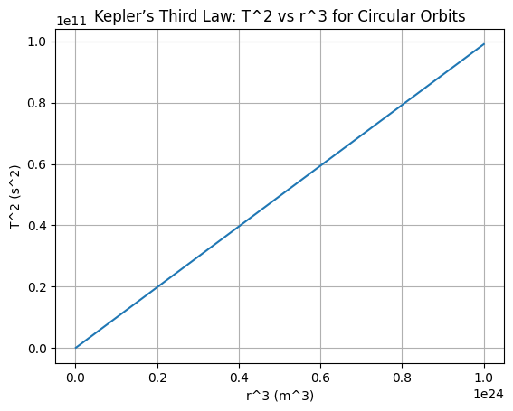

# Problem 1
🌍 Orbital Period and Orbital Radius
Motivation
The relationship between the square of the orbital period and the cube of the orbital radius, known as Kepler's Third Law, is a cornerstone of celestial mechanics. This simple yet profound relationship allows for the determination of planetary motions and has implications for understanding gravitational interactions on both local and cosmic scales. By analyzing this relationship, one can connect fundamental principles of gravity with real-world phenomena such as satellite orbits and planetary systems.
Derivation for Circular Orbits
Kepler's Third Law describes the relationship between the orbital period 
𝑇
T and the orbital radius 
𝑟
r. Let’s derive this relationship for circular orbits.

1. Gravitational Force = Centripetal Force
The gravitational force acting between two objects (e.g., the Earth and the Moon) is given by:
$$
\frac{GMm}{r^2} = \frac{mv^2}{r}
$$
Here:

𝐺
G is the gravitational constant.

𝑀
M is the mass of the central body (Earth).

𝑚
m is the mass of the orbiting body (Moon).

𝑟
r is the distance between the two bodies.

𝑣
v is the orbital velocity of the orbiting body.
2. Simplifying the Equation
We can cancel out the mass of the orbiting body 
𝑚
m and solve for the velocity 
𝑣
v:
$$
v^2 = \frac{GM}{r}
$$
3. Relating Orbital Velocity to Orbital Period
The orbital velocity 
𝑣
v is related to the orbital period 
𝑇
T by the equation:
$$
v = \frac{2\pi r}{T}
$$
4. Substitute the Velocity Expression
Now, we substitute the expression for 
𝑣
v into the previous equation:
$$
\left( \frac{2\pi r}{T} \right)^2 = \frac{GM}{r}
$$
5. Solve for the Orbital Period
Simplifying the above equation:
$$
\frac{4\pi^2 r^2}{T^2} = \frac{GM}{r}
T^2 = \frac{4\pi^2}{GM} \cdot r^3
$$
This is Kepler’s Third Law for circular orbits. It shows that the square of the orbital period is proportional to the cube of the orbital radius.
🌌 Generalization to Elliptical Orbits
For elliptical orbits, the semi-major axis 
𝑎
a replaces the orbital radius 
𝑟
r, and the masses of both bodies are taken into account. The generalized form of Kepler's Third Law for elliptical orbits is:
$$
T^2 = \frac{4\pi^2}{G(M + m)} \cdot a^3
$$
Here:

𝑀
M is the mass of the central body (e.g., the Sun).

𝑚
m is the mass of the orbiting body (e.g., a planet).

𝑎
a is the semi-major axis of the elliptical orbit.
🌑 Real-World Example: The Moon and the Earth
To apply Kepler’s Third Law to the Moon’s orbit around Earth:

Average orbital radius 
𝑟=3.84×108m
r=3.84×108m

Orbital period 𝑇≈27.3
 
days=2.36×10s
T≈27.3days=2.36×10s

Using Kepler’s Third Law:
$$
T^2 = \frac{4\pi^2}{GM} \cdot r^3
$$
This allows us to calculate the mass of the Earth or verify the Moon’s orbital parameters.
💻 Simulation and Visualization
To simulate circular orbits and verify the relationship between orbital period and radius, we can write Python code. The relationship 

For example, the Python code could look like this:

```python
import numpy as np
import matplotlib.pyplot as plt

# Constants
G = 6.67430e-11  # Gravitational constant in m^3 kg^-1 s^-2
M = 5.972e24  # Mass of Earth in kg

# Different orbital radii in meters
radii = np.linspace(1e7, 1e8, 100)

# Calculate orbital period squared (T^2 = 4π^2 * r^3 / GM)
T_squared = (4 * np.pi**2 * radii**3) / (G * M)

# Plot the relationship
plt.plot(radii**3, T_squared)
plt.xlabel('r^3 (m^3)')
plt.ylabel('T^2 (s^2)')
plt.title('Kepler’s Third Law: T^2 vs r^3')
plt.grid(True)
plt.show() 


