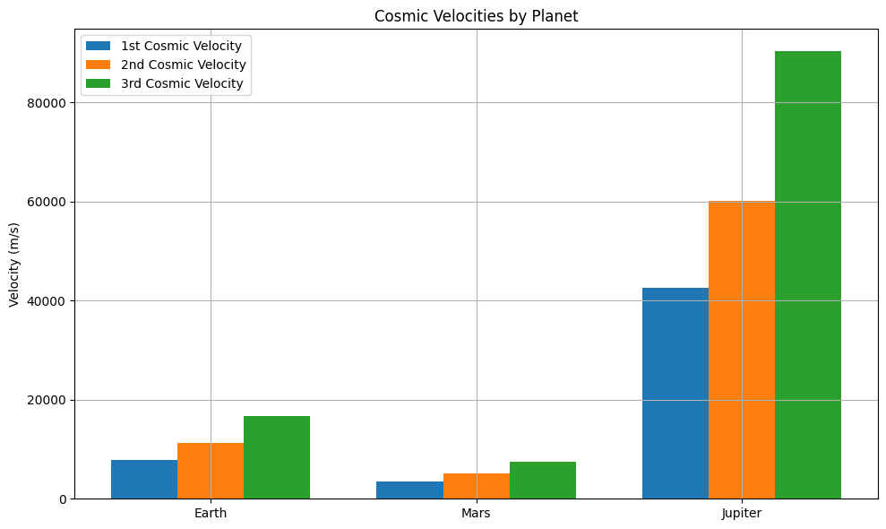

# Problem 2
🚀 Escape Velocities and Cosmic Velocities

🧭 Motivation

Understanding escape velocity is crucial for space missions. It's the minimum speed needed to break free from a planet's gravitational pull. Expanding on this idea, the first, second, and third cosmic velocities define thresholds in space travel:

-**Reaching orbit**
-**Escaping a planet**
-**The Solar System**

These are key concepts in satellite launches, Moon/Mars missions, and interstellar probes.

🧠 Definitions
#1️⃣First Cosmic Velocity
Meaning: Minimum speed to enter a circular orbit close to the surface of a planet.

Formula:

$v_1 = \sqrt{\frac{G M}{R}}$

Where:

$G$: Gravitational constant = 6.674 \times 10^{-11} \ \text{m}^3/\text{kg}/\text{s}^2

$M$: Mass of the planet (kg)

$R$: Radius from the planet's center (m)

2️⃣ Second Cosmic Velocity (Escape Velocity)
Meaning: Minimum speed to completely escape a planet's gravity.

Formula:

$v_2 = \sqrt{2} \cdot v_1 = \sqrt{\frac{2 G M}{R}}$

 Third Cosmic Velocity
Meaning: Approximate speed needed to leave the Sun’s gravitational influence from a planet’s surface.

Formula (approximate):

$v_3 \approx 1.5 \cdot v_2 = 1.5 \cdot \sqrt{\frac{2 G M}{R}}$

📐 Parameters Affecting Velocity
Mass ($M$): Heavier planets have stronger gravity → higher velocities.

Radius ($R$): Larger radius means you're further from the center → lower velocities.

🧮 Python Code for Calculations & Graphs

```python
import numpy as np
import matplotlib.pyplot as plt

# Gravitational constant
G = 6.67430e-11  # m^3 kg^-1 s^-2

# Celestial bodies: mass in kg, radius in meters
bodies = {
    "Earth": {"mass": 5.972e24, "radius": 6.371e6},
    "Mars": {"mass": 6.417e23, "radius": 3.3895e6},
    "Jupiter": {"mass": 1.898e27, "radius": 6.9911e7},
}

def compute_velocities(mass, radius):
    v1 = np.sqrt(G * mass / radius)          # 1st cosmic velocity
    v2 = np.sqrt(2) * v1                     # escape velocity
    v3 = 1.5 * v2                            # approximate 3rd cosmic velocity
    return v1, v2, v3

# Calculate velocities
results = {}
for name, data in bodies.items():
    v1, v2, v3 = compute_velocities(data["mass"], data["radius"])
    results[name] = {"v1": v1, "v2": v2, "v3": v3}

# Plotting
labels = list(results.keys())
v1_list = [results[b]["v1"] for b in labels]
v2_list = [results[b]["v2"] for b in labels]
v3_list = [results[b]["v3"] for b in labels]

x = np.arange(len(labels))
width = 0.25

plt.figure(figsize=(10, 6))
plt.bar(x - width, v1_list, width, label="1st Cosmic Velocity")
plt.bar(x, v2_list, width, label="2nd Cosmic Velocity")
plt.bar(x + width, v3_list, width, label="3rd Cosmic Velocity")
plt.xticks(x, labels)
plt.ylabel("Velocity (m/s)")
plt.title("Cosmic Velocities by Planet")
plt.legend()
plt.grid(True)
plt.tight_layout()
plt.show()
```

# Print results

<table style="border-collapse: collapse; width: 60%; margin: 20px auto; font-family: Arial, sans-serif;">
  <caption style="caption-side: top; font-weight: bold; margin-bottom: 10px;">📊 Cosmic Velocity Table</caption>
  <thead>
    <tr style="background-color: #eee;">
      <th style="border: 1px solid #ccc; padding: 8px;">Planet</th>
      <th style="border: 1px solid #ccc; padding: 8px;">v₁ (m/s)</th>
      <th style="border: 1px solid #ccc; padding: 8px;">v₂ (m/s)</th>
      <th style="border: 1px solid #ccc; padding: 8px;">v₃ (m/s)</th>
    </tr>
  </thead>
  <tbody>
    <tr>
      <td style="border: 1px solid #ccc; padding: 8px;">Earth</td>
      <td style="border: 1px solid #ccc; padding: 8px;">7909.68</td>
      <td style="border: 1px solid #ccc; padding: 8px;">11185.98</td>
      <td style="border: 1px solid #ccc; padding: 8px;">16778.97</td>
    </tr>
    <tr>
      <td style="border: 1px solid #ccc; padding: 8px;">Mars</td>
      <td style="border: 1px solid #ccc; padding: 8px;">3554.68</td>
      <td style="border: 1px solid #ccc; padding: 8px;">5027.08</td>
      <td style="border: 1px solid #ccc; padding: 8px;">7540.62</td>
    </tr>
    <tr>
      <td style="border: 1px solid #ccc; padding: 8px;">Jupiter</td>
      <td style="border: 1px solid #ccc; padding: 8px;">42567.51</td>
      <td style="border: 1px solid #ccc; padding: 8px;">60199.54</td>
      <td style="border: 1px solid #ccc; padding: 8px;">90299.32</td>
    </tr>
  </tbody>
</table>


🚀 Relevance in Space Exploration
Mission Type | Required 

Orbital Satellite | $v_1$

Planetary Escape Missions | $v_2$

Interstellar Missions | $v_3$


✅ Conclusion
The cosmic velocities define the energy requirements to transition between gravitational zones:

Low Earth orbit needs $v_1$
Moon and Mars missions need at least $v_2$
Voyager-style interstellar probes require $v_3$



$$
<table border="1" cellpadding="10" cellspacing="0" style="border-collapse: collapse; margin: 20px auto; font-family: sans-serif;">
  <caption style="font-weight: bold; margin-bottom: 10px;">📊 Cosmic Velocity Table</caption>
  <thead>
    <tr style="background-color: #f2f2f2;">
      <th>Planet</th>
      <th>v₁ (m/s)</th>
      <th>v₂ (m/s)</th>
      <th>v₃ (m/s)</th>
    </tr>
  </thead>
  <tbody>
    <tr>
      <td>Earth</td>
      <td>7909.68</td>
      <td>11185.98</td>
      <td>16778.97</td>
    </tr>
    <tr>
      <td>Mars</td>
      <td>3554.68</td>
      <td>5027.08</td>
      <td>7540.62</td>
    </tr>
    <tr>
      <td>Jupiter</td>
      <td>42567.51</td>
      <td>60199.54</td>
      <td>90299.32</td>
    </tr>
  </tbody>
</table>


