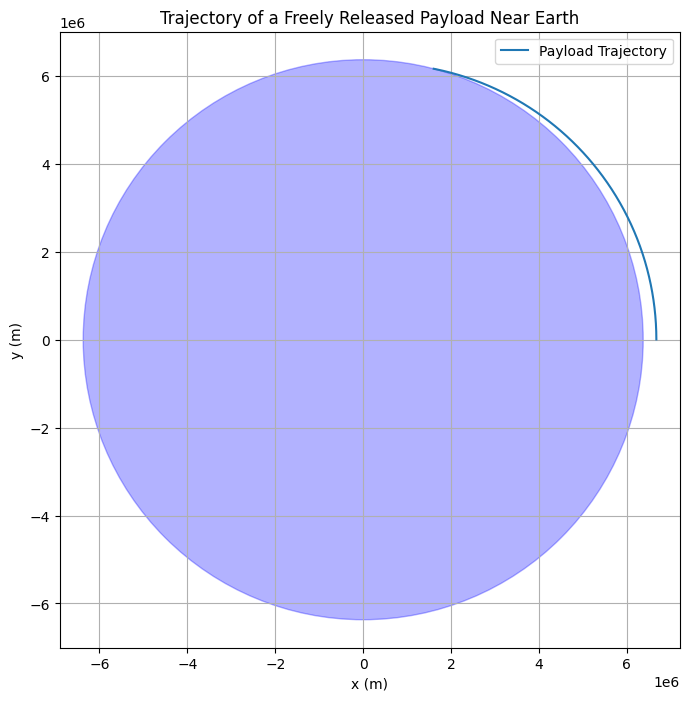

# Problem 3
🛰️ Trajectories of a Freely Released Payload Near Earth


📌 Motivation
When a payload is released from a rocket near Earth, its path depends on its initial velocity and position, and the only acting force is typically Earth's gravity. Understanding these trajectories is essential for:

1-Orbital insertion,

2-Re-entry capsules,

3-Space debris tracking,

4-Interplanetary mission planning.

🎯 Objective

Identify types of trajectories: elliptical, parabolic, hyperbolic, sub-orbital.
Simulate motion based on initial velocity and altitude.
Classify outcomes (orbit, escape, re-entry).
Visualize trajectories using Python.

🧠 Physics and Equations


1️⃣ Newton's Law of Universal Gravitation

The gravitational force acting on the payload:
$$
F = G \cdot \frac{M \cdot m}{r^2}
$$
Where:
$$
G = 6.674 \times 10^{-11} \ \text{Nm}^2/\text{kg}^2
$$

M: Mass of Earth
m: Mass of payload
r: Distance from Earth's center


2️⃣ Total Mechanical Energy

Total specific mechanical energy (per unit mass):
$$
\epsilon = \frac{v^2}{2} - \frac{G M}{r}
$$

Where:

v: Speed of the payload

r: Distance from Earth's center


<table style="border-collapse: collapse; width: 70%; margin: 20px auto; font-family: Arial, sans-serif;">
  <caption style="caption-side: top; font-weight: bold; margin-bottom: 10px;">📊 Velocity and Trajectory Types</caption>
  <thead>
    <tr style="background-color: #f2f2f2;">
      <th style="border: 1px solid #ccc; padding: 8px;">Speed (v) [m/s]</th>
      <th style="border: 1px solid #ccc; padding: 8px;">Trajectory Type</th>
      <th style="border: 1px solid #ccc; padding: 8px;">Energy (ε)</th>
    </tr>
  </thead>
  <tbody>
    <tr>
      <td style="border: 1px solid #ccc; padding: 8px;">&lt; 7500</td>
      <td style="border: 1px solid #ccc; padding: 8px;">Elliptical orbit (ε &lt; 0)</td>
      <td style="border: 1px solid #ccc; padding: 8px;">Energy is negative (sub-orbital motion)</td>
    </tr>
    <tr>
      <td style="border: 1px solid #ccc; padding: 8px;">~7500 - 7900</td>
      <td style="border: 1px solid #ccc; padding: 8px;">Elliptical orbit (ε &lt; 0)</td>
      <td style="border: 1px solid #ccc; padding: 8px;">Energy is negative (sub-orbital motion)</td>
    </tr>
    <tr>
      <td style="border: 1px solid #ccc; padding: 8px;">11180</td>
      <td style="border: 1px solid #ccc; padding: 8px;">Parabolic escape (ε = 0)</td>
      <td style="border: 1px solid #ccc; padding: 8px;">Energy is zero (just escaping the planet)</td>
    </tr>
    <tr>
      <td style="border: 1px solid #ccc; padding: 8px;">&gt; 11200</td>
      <td style="border: 1px solid #ccc; padding: 8px;">Hyperbolic escape (ε &gt; 0)</td>
      <td style="border: 1px solid #ccc; padding: 8px;">Energy is positive (escaping with excess energy)</td>
    </tr>
  </tbody>
</table>

3️⃣ Orbital Velocities

First Cosmic Velocity:
$$
v_1 = \sqrt{\frac{G M}{R}}
$$

Second Cosmic Velocity (escape velocity):
$$
v_2 = \sqrt{2} \cdot v_1 = \sqrt{\frac{2 G M}{R}}
$$
General Specific Energy:
$$
\epsilon = \frac{v^2}{2} - \frac{G M}{r}
$$

 Python Simulation Code

```python
import numpy as np
import matplotlib.pyplot as plt
import numpy as np
import matplotlib.pyplot as plt

# Constants
G = 6.67430e-11       # Gravitational constant (m^3/kg/s^2)
M = 5.972e24          # Mass of Earth (kg)
R_earth = 6.371e6     # Earth radius (m)

# Simulation parameters
dt = 1                # Time step (seconds)
t_max = 10000         # Max time (seconds)

# Initial conditions
r0 = np.array([R_earth + 300e3, 0])     # 300 km altitude
v0 = np.array([0, 7500])                # Initial velocity

def acceleration(r):
    norm_r = np.linalg.norm(r)
    return -G * M * r / norm_r**3

def simulate(r0, v0):
    r = r0.copy()
    v = v0.copy()
    trajectory = []
    for _ in range(int(t_max / dt)):
        # Calculate acceleration due to gravity
        a = acceleration(r)
        
        # Update velocity
        v = v + a * dt
        
        # Update position
        r = r + v * dt
        
        # Save the current position in the trajectory
        trajectory.append(r.copy())
        
        # Check if the object has crashed into Earth
        if np.linalg.norm(r) <= R_earth:
            break
    
    return np.array(trajectory)

# Run simulation
trajectory = simulate(r0, v0)

# Plot
plt.figure(figsize=(8, 8))
plt.plot(trajectory[:, 0], trajectory[:, 1], label="Payload Trajectory")

# Plot Earth as a circle
earth = plt.Circle((0, 0), R_earth, color='blue', alpha=0.3)
plt.gca().add_patch(earth)

# Setting plot limits
plt.xlim(-1.5 * R_earth, 1.5 * R_earth)
plt.ylim(-1.5 * R_earth, 1.5 * R_earth)

# Labels and title
plt.axis('equal')
plt.grid(True)
plt.title("Trajectory of a Freely Released Payload Near Earth")
plt.xlabel("x (m)")
plt.ylabel("y (m)")
plt.legend()
plt.show()
```

<table style="border-collapse: collapse; width: 60%; margin: 20px auto; font-family: Arial, sans-serif;">
  <caption style="caption-side: top; font-weight: bold; margin-bottom: 10px;">📊 Sample Velocity Outcomes</caption>
  <thead>
    <tr style="background-color: #f2f2f2;">
      <th style="border: 1px solid #ccc; padding: 8px;">Initial Velocity (m/s)</th>
      <th style="border: 1px solid #ccc; padding: 8px;">Outcome</th>
      <th style="border: 1px solid #ccc; padding: 8px;">Energy (ε)</th>
    </tr>
  </thead>
  <tbody>
    <tr>
      <td style="border: 1px solid #ccc; padding: 8px;">&lt; 7500</td>
      <td style="border: 1px solid #ccc; padding: 8px;">Sub-orbital (falls)</td>
      <td style="border: 1px solid #ccc; padding: 8px;">ε &lt; 0</td>
    </tr>
    <tr>
      <td style="border: 1px solid #ccc; padding: 8px;">~7500 - 7900</td>
      <td style="border: 1px solid #ccc; padding: 8px;">Elliptical orbit</td>
      <td style="border: 1px solid #ccc; padding: 8px;">ε &lt; 0</td>
    </tr>
    <tr>
      <td style="border: 1px solid #ccc; padding: 8px;">11180</td>
      <td style="border: 1px solid #ccc; padding: 8px;">Escape (parabolic)</td>
      <td style="border: 1px solid #ccc; padding: 8px;">ε = 0</td>
    </tr>
    <tr>
      <td style="border: 1px solid #ccc; padding: 8px;">&gt; 11200</td>
      <td style="border: 1px solid #ccc; padding: 8px;">Hyperbolic escape</td>
      <td style="border: 1px solid #ccc; padding: 8px;">ε &gt; 0</td>
    </tr>
  </tbody>
</table>


<!DOCTYPE html>
<html lang="en">
<head>
  <meta charset="UTF-8">
  <meta name="viewport" content="width=device-width, initial-scale=1.0">
  <title>Real-World Applications - Space Velocities</title>
  <style>
    /* Global Styles */
    body {
      font-family: 'Arial', sans-serif;
      background-color: #f4f4f9;
      color: #333;
      line-height: 1.6;
      margin: 0;
      padding: 0;
    }
    h1, h2 {
      color: #4CAF50;
      text-align: center;
      margin-top: 20px;
    }
    /* Table Styles */
    table {
      width: 80%;
      margin: 20px auto;
      border-collapse: collapse;
      background-color: #fff;
      box-shadow: 0 4px 8px rgba(0, 0, 0, 0.1);
    }
    th, td {
      padding: 12px;
      border: 1px solid #ddd;
      text-align: left;
    }
    th {
      background-color: #4CAF50;
      color: white;
      text-transform: uppercase;
    }
    tr:nth-child(even) {
      background-color: #f2f2f2;
    }
    tr:hover {
      background-color: #ddd;
    }
    /* Container for the Real-World Applications */
    .container {
      padding: 20px;
    }
    .application {
      margin: 20px 0;
      padding: 15px;
      background-color: #fff;
      border-radius: 8px;
      box-shadow: 0 2px 4px rgba(0, 0, 0, 0.1);
    }
    .application h3 {
      color: #4CAF50;
    }
    .application p {
      font-size: 1.1em;
      line-height: 1.8;
    }
  </style>
</head>
<body>

  <h1>🚀 Real-World Applications of Space Velocities</h1>

  <div class="container">
    <div class="application">
      <h3>1. Satellite Deployment</h3>
      <p>To deploy satellites in specific orbits, the <strong>initial velocity (v₀)</strong> must be adjusted according to the desired orbital path (e.g., low Earth orbit, geostationary orbit). This ensures the satellite reaches and maintains its intended orbit.</p>
    </div>

    <div class="application">
      <h3>2. Controlled Re-entry</h3>
      <p>During controlled re-entry, spacecraft need to reduce their <strong>initial velocity (v₀)</strong>. By slowing down, they can safely re-enter Earth's atmosphere and land without burning up. This is crucial for crewed missions and cargo returns.</p>
    </div>

    <div class="application">
      <h3>3. Interplanetary Probes</h3>
      <p>To send spacecraft to other planets, their <strong>initial velocity (v₀)</strong> must be increased to reach escape velocity. This allows the probe to break free from Earth's gravitational pull and travel to its target destination, such as Mars or beyond.</p>
    </div>

    <div class="application">
      <h3>4. Debris Tracking</h3>
      <p>Analyzing the trajectories of space debris involves calculating and monitoring their <strong>velocities</strong> to predict possible collisions with satellites or spacecraft. By understanding these trajectories, safety measures can be taken to avoid potential damage.</p>
    </div>
  </div>

  <h2>📊 Sample Velocity Outcomes</h2>
  <table>
    <thead>
      <tr>
        <th>Speed (v) [m/s]</th>
        <th>Trajectory Type</th>
        <th>Energy (ε)</th>
      </tr>
    </thead>
    <tbody>
      <tr>
        <td>&lt; 7500</td>
        <td>Elliptical orbit (ε &lt; 0)</td>
        <td>Energy is negative (sub-orbital motion)</td>
      </tr>
      <tr>
        <td>~7500 - 7900</td>
        <td>Elliptical orbit (ε &lt; 0)</td>
        <td>Energy is negative (sub-orbital motion)</td>
      </tr>
      <tr>
        <td>11180</td>
        <td>Parabolic escape (ε = 0)</td>
        <td>Energy is zero (just escaping the planet)</td>
      </tr>
      <tr>
        <td>&gt; 11200</td>
        <td>Hyperbolic escape (ε &gt; 0)</td>
        <td>Energy is positive (escaping with excess energy)</td>
      </tr>
    </tbody>
  </table>

</body>
</html>


✅ Conclusion

Using \frac{}-based formulas and Newtonian mechanics, we can:

Classify payload motion,
Simulate and visualize it,
Apply it to real mission scenarios.




