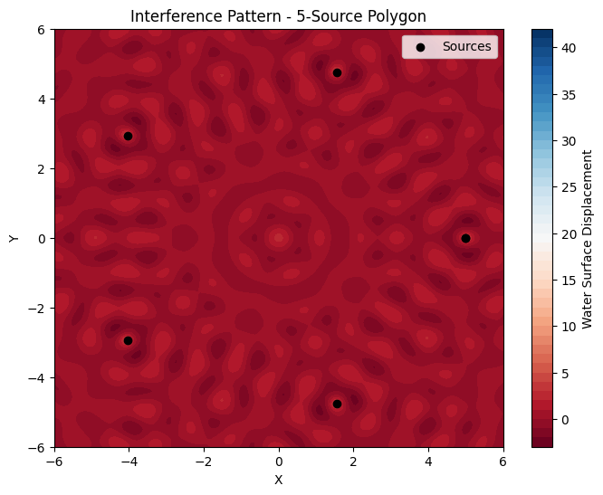

# Problem 1
Interference Patterns on a water surface
MOTIVATION:
Interference occurs when waves from different sources overlap, creating new patterns. On a water surface, this can be easily observed when ripples from different points meet, forming distinctive interference patterns. These patterns can show us how waves combine in different ways, either reinforcing each other or cancelling out.

Studying these patterns helps us understand wave behavior in a simple, visual way. It also allows us to explore important concepts, like the relationship between wave phase and the effects of multiple sources. This task offers a hands-on approach to learning about wave interactions and their real-world applications, making it an interesting and engaging way to dive into wave physics.

TASK:
A circular wave on the water surface, emanating from a point source located at 
(𝑥0,𝑦0) (x0,y0​), can be described by the Single Disturbance equation:
$$
\eta(x, y, t) = \frac{A}{\sqrt{r}} \cos \left( k r - \omega t + \phi \right)
$$
where:

$$
\eta(x, y, t) \quad \text{is the displacement of the water surface at point} \ (x, y) \ \text{and time} \ t,
$$

$$
A \quad \text{is the amplitude of the wave},
$$

$$
k = \frac{2\pi}{\lambda} \quad \text{is the wave number, related to the wavelength} \ \lambda,
$$

$$
\omega = 2\pi f \quad \text{is the angular frequency, related to the frequency} \ f,
$$

$$
r = \sqrt{(x - x_0)^2 + (y - y_0)^2} \quad \text{is the distance from the source to the point} \ (x, y),
$$

$$
\phi \quad \text{is the initial phase.}
$$

STEPS TO FOLLOW:
SELECT A REGULAR POLYGON: Choose a regular polygon (e.g., equilateral triangle, square, regular pentagon).

POSITION THE SOURCES: Place point wave sources at the vertices of the selected polygon.

WAVE EQUATIONS: Write the equations describing the waves emitted from each source, considering their respective positions.

SUPERPOSITION OF WAVES: Apply the principle of superposition by summing the wave displacements at each point on the water surface:
$$
\eta_{\text{sum}}(x, y, t) = \sum_{i=1}^{N} \eta_i(x, y, t)
$$
where

$$
N \quad \text{is the number of sources (vertices of the polygon).}
$$

\textbf{ANALYZE INTERFERENCE PATTERNS:} Examine the resulting displacement

$$
\eta_{\text{sum}}(x, y, t) \quad \text{as a function of position} \ (x, y) \ \text{and time} \ t. \quad \text{Identify regions of constructive interference (wave amplification) and destructive interference (wave cancellation).}
$$

VISUALIZATION: Present your findings graphically, illustrating the interference patterns for the chosen regular polygon.

CONSIDERATIONS:

Assume all sources emit waves with the same amplitude 
𝐴
A, wavelength 
𝜆
λ, and frequency 
𝑓
f.

The waves are coherent, maintaining a constant phase difference.

For analysis and visualization, you may use simulation and graphical tools such as Python with libraries like Matplotlib, or other software tools capable of plotting wave patterns and interference.

Ensure that the visualization highlights the interference regions of constructive and destructive interference, showing wave amplification and cancellation effects clearly.

DELIVERABLES:
A Markdown document with Python script or notebook implementing the simulations.

A detailed explanation of the interference patterns, with the goal of understanding wave superposition for the chosen regular polygon.

Graphical representations of the water surface showing constructive and destructive interference regions.

Formulas in frac Version:
Wave Displacement (Single Source)
$$
\eta(x, y, t) = \frac{A}{\sqrt{r}} \cos \left( k r - \omega t + \phi \right)
$$
Wave Number (k):
$$
k = \frac{2 \pi}{\lambda}
$$
Angular Frequency (𝜔):
$$
\omega = 2 \pi f
$$
Distance from Source (r):
$$
r = \sqrt{(x - x_0)^2 + (y - y_0)^2}
$$
Superposition (Sum of Waves):
$$
\eta_{\text{sum}}(x, y, t) = \sum_{i=1}^{N} \eta_i(x, y, t)
$$
where 
𝑁
N is the number of sources (vertices of the polygon).
```python
import numpy as np
import matplotlib.pyplot as plt

# Parameters
A = 1              # Amplitude
lambda_ = 1        # Wavelength
f = 1              # Frequency
omega = 2 * np.pi * f  # Angular frequency
k = 2 * np.pi / lambda_  # Wave number
phi = 0            # Initial phase
num_sources = 5    # Number of polygon vertices (5 for pentagon)
radius = 5         # Radius of the polygon from the center
time = 0           # Time

# Coordinates (vertices of the regular polygon)
theta = np.linspace(0, 2 * np.pi, num_sources + 1)
x_sources = radius * np.cos(theta)
y_sources = radius * np.sin(theta)

# Create grid for the water surface
x_range = np.linspace(-6, 6, 300)
y_range = np.linspace(-6, 6, 300)
X, Y = np.meshgrid(x_range, y_range)

# Superposition calculation
eta_sum = np.zeros_like(X)

for i in range(num_sources):
    # Contribution from each source
    r = np.sqrt((X - x_sources[i])**2 + (Y - y_sources[i])**2)
    eta = A / np.sqrt(r) * np.cos(k * r - omega * time + phi)
    eta_sum += eta

# Visualizing the interference pattern
plt.figure(figsize=(8, 6))
plt.contourf(X, Y, eta_sum, 50, cmap='RdBu')
plt.colorbar(label='Water Surface Displacement')
plt.scatter(x_sources, y_sources, color='black', label='Sources', zorder=5)
plt.title(f"Interference Pattern - {num_sources}-Source Polygon")
plt.xlabel('X')
plt.ylabel('Y')
plt.legend()
plt.show()
```



