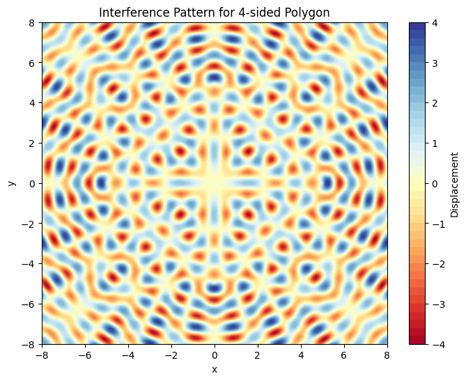
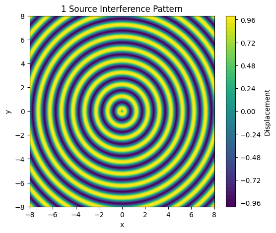
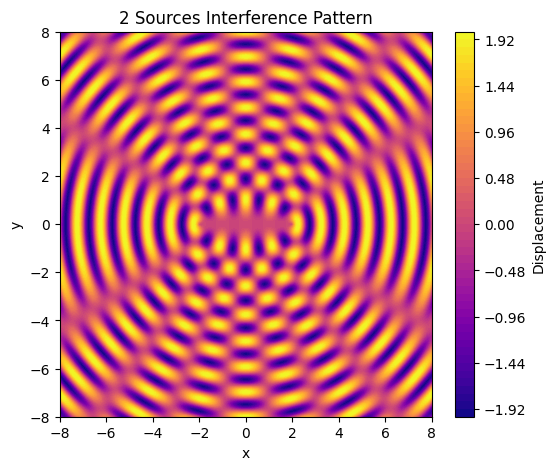
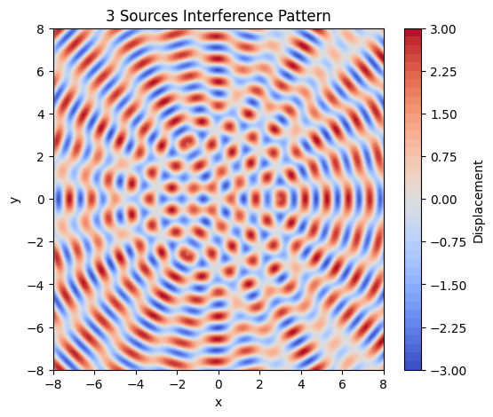
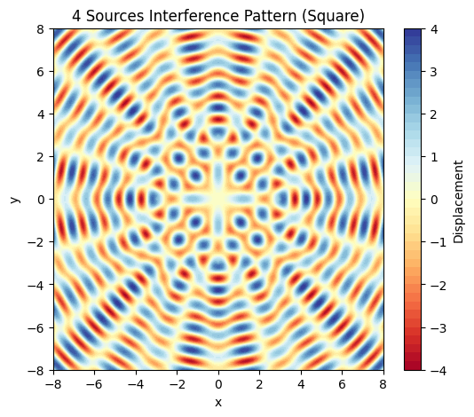

# Problem1
### Motivation

<!DOCTYPE html>
<html lang="en">
<head>
    <meta charset="UTF-8">
    <meta name="viewport" content="width=device-width, initial-scale=1.0">
    <title>Wave Interference Concepts</title>
    <link rel="stylesheet" href="styles.css">
</head>
<body>
    <section class="interference-section">
        <h2>Wave Interference: Key Concepts</h2>
        <ul>
            <li>
                <strong>Interference Overview</strong>
                <p>Waves from different sources overlap to form new patterns.</p>
            </li>
            <li>
                <strong>Types of Interference</strong>
                <ul>
                    <li><strong>Constructive:</strong> In-phase waves, larger amplitudes.</li>
                    <li><strong>Destructive:</strong> Out-of-phase waves, reduced amplitudes.</li>
                </ul>
            </li>
            <li>
                <strong>Wave Sources</strong>
                <p>Ripples originate from distinct points (e.g., on water).</p>
                <p>Example: Two point sources interact to produce patterns.</p>
            </li>
            <li>
                <strong>Interference Patterns</strong>
                <p>Nodal lines: Areas of wave cancellation (destructive).</p>
                <p>Antinodes: Areas of wave amplification (constructive).</p>
                <p>Depend on source spacing, wavelength, and phase differences.</p>
            </li>
            <li>
                <strong>Phase Relationship</strong>
                <p>Relative wave phase dictates interference type:</p>
                <ul>
                    <li>In phase: Constructive.</li>
                    <li>Out of phase: Destructive.</li>
                </ul>
            </li>
        </ul>
    </section>
</body>
</html>

### Task

A circular wave on the water surface, emanating from a point source located at (x₀, y₀), can be described by the **Single Disturbance** equation:

$$
\text{Displacement}(r,t) = A \sin(k r - \omega t + \phi)
$$

where:

- **r** is the distance from the source to the point (x, y),
- **A** is the amplitude of the wave,
- **k** is the wave number, related to the wavelength ($\lambda$),
- **ω** is the angular frequency, related to the frequency (f),
- **t** is time,
- **φ** is the initial phase.

### Problem Statement

Your task is to analyze the interference patterns formed on the water surface due to the superposition of waves emitted from point sources placed at the vertices of a chosen regular polygon.

### Steps to Follow

1. **Select a Regular Polygon**: Choose a regular polygon (e.g., equilateral triangle, square, regular pentagon).
2. **Position the Sources**: Place point wave sources at the vertices of the selected polygon.
3. **Wave Equations**: Write the equations describing the waves emitted from each source, considering their respective positions.
4. **Superposition of Waves**: Apply the principle of superposition by summing the wave displacements at each point on the water surface:

$$
\text{Displacement}(r,t) = \sum_{i=1}^{N} A_i \sin(k r_i - \omega t + \phi_i)
$$

where **N** is the number of sources (vertices of the polygon).
5. **Analyze Interference Patterns**: Examine the resulting displacement **D(x, y, t)** as a function of position **(x, y)** and time **t**. Identify regions of constructive interference (wave amplification) and destructive interference (wave cancellation).
6. **Visualization**: Present your findings graphically, illustrating the interference patterns for the chosen regular polygon.

### Considerations

- Assume all sources emit waves with the same amplitude, wavelength, and frequency.
- The waves are coherent, maintaining a constant phase difference.
- You may use simulation and visualization tools such as Python (with libraries like Matplotlib), or other graphical software to aid in your analysis.

### Deliverables

- A Markdown document with a Python script or notebook implementing the simulations.
- A detailed explanation of the interference patterns observed for the chosen regular polygon with the goal of understanding wave superposition.
- Graphical representations of the water surface showing constructive and destructive interference regions.

---



✅ 1. One Point Source
# Interference from a single point source

Description: A single point source generates circular wavefronts radiating outward uniformly. No interference occurs, only basic wave propagation is visible.

```python
import numpy as np
import matplotlib.pyplot as plt

A = 1
lambda_ = 1
k = 2 * np.pi / lambda_
omega = 2 * np.pi
phi = 0
source = (0, 0)

x_vals = np.linspace(-8, 8, 400)
y_vals = np.linspace(-8, 8, 400)
X, Y = np.meshgrid(x_vals, y_vals)

r = np.sqrt((X - source[0])**2 + (Y - source[1])**2)
Z = A * np.sin(k * r + phi)

plt.figure(figsize=(6, 5))
plt.contourf(X, Y, Z, levels=50, cmap='viridis')
plt.title("1 Source Interference Pattern")
plt.xlabel("x")
plt.ylabel("y")
plt.colorbar(label="Displacement")
plt.show()
```



✅ 2. Two Point Sources
# Interference from two coherent point sources
Description: Two coherent sources interfere to produce a classic pattern of alternating constructive and destructive interference — producing nodal and antinodal lines

```python
import numpy as np
import matplotlib.pyplot as plt

A = 1
lambda_ = 1
k = 2 * np.pi / lambda_
phi = 0
sources = [(-2, 0), (2, 0)]

x_vals = np.linspace(-8, 8, 400)
y_vals = np.linspace(-8, 8, 400)
X, Y = np.meshgrid(x_vals, y_vals)

Z = np.zeros_like(X)
for (xs, ys) in sources:
    r = np.sqrt((X - xs)**2 + (Y - ys)**2)
    Z += A * np.sin(k * r + phi)

plt.figure(figsize=(6, 5))
plt.contourf(X, Y, Z, levels=50, cmap='plasma')
plt.title("2 Sources Interference Pattern")
plt.xlabel("x")
plt.ylabel("y")
plt.colorbar(label="Displacement")
plt.show()
```


✅ 3. Three Point Sources (Equilateral Triangle)

# Interference from three sources in an equilateral triangle
Description: Three sources arranged in an equilateral triangle generate a more complex interference pattern with symmetry but additional regions of chaotic interaction.

```python
import numpy as np
import matplotlib.pyplot as plt

A = 1
lambda_ = 1
k = 2 * np.pi / lambda_
phi = 0
radius = 3
angles = np.linspace(0, 2 * np.pi, 3, endpoint=False)
sources = [(radius * np.cos(a), radius * np.sin(a)) for a in angles]

x_vals = np.linspace(-8, 8, 400)
y_vals = np.linspace(-8, 8, 400)
X, Y = np.meshgrid(x_vals, y_vals)

Z = np.zeros_like(X)
for (xs, ys) in sources:
    r = np.sqrt((X - xs)**2 + (Y - ys)**2)
    Z += A * np.sin(k * r + phi)

plt.figure(figsize=(6, 5))
plt.contourf(X, Y, Z, levels=50, cmap='coolwarm')
plt.title("3 Sources Interference Pattern")
plt.xlabel("x")
plt.ylabel("y")
plt.colorbar(label="Displacement")
plt.show()
```


✅ 4. Four Point Sources (Square)

# Interference from four sources at the corners of a square
Description: Four sources placed at the corners of a square form an interference pattern exhibiting strong symmetry, with clear grid-like nodal and antinodal regions.

```python
import numpy as np
import matplotlib.pyplot as plt

A = 1
lambda_ = 1
k = 2 * np.pi / lambda_
phi = 0
radius = 3
angles = np.linspace(0, 2 * np.pi, 4, endpoint=False)
sources = [(radius * np.cos(a), radius * np.sin(a)) for a in angles]

x_vals = np.linspace(-8, 8, 400)
y_vals = np.linspace(-8, 8, 400)
X, Y = np.meshgrid(x_vals, y_vals)

Z = np.zeros_like(X)
for (xs, ys) in sources:
    r = np.sqrt((X - xs)**2 + (Y - ys)**2)
    Z += A * np.sin(k * r + phi)

plt.figure(figsize=(6, 5))
plt.contourf(X, Y, Z, levels=50, cmap='RdYlBu')
plt.title("4 Sources Interference Pattern (Square)")
plt.xlabel("x")
plt.ylabel("y")
plt.colorbar(label="Displacement")
plt.show()
```
