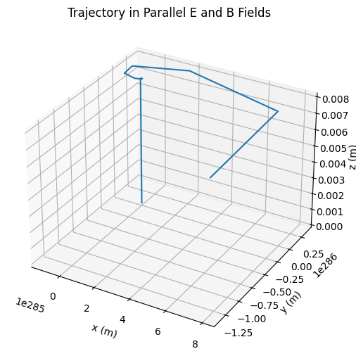
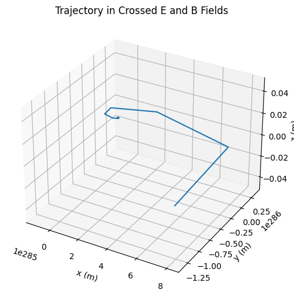
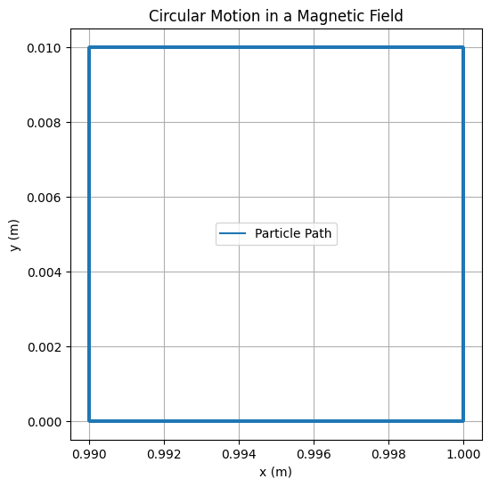
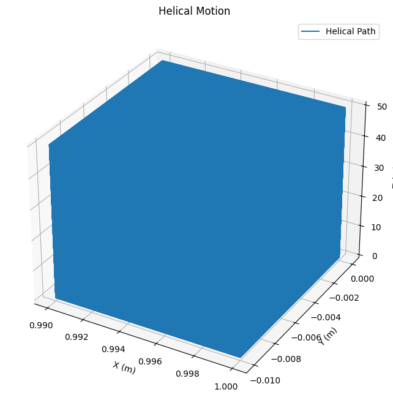
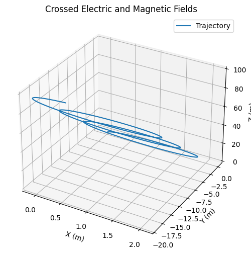

# Problem 1
#  Simulating the Effects of the Lorentz Force

## Motivation

The **Lorentz force** governs the motion of charged particles under the influence of electric and magnetic fields. It plays a foundational role in fields such as plasma physics, particle accelerators, electromagnetic traps, and space physics. The force is defined by the equation:

\[
\vec{F} = q(\vec{E} + \vec{v} \times \vec{B})
\]

Where:

- \( \vec{F} \) is the total force on the particle,

- \( q \) is the electric charge,

- \( \vec{E} \) is the electric field,

- \( \vec{B} \) is the magnetic field,

- \( \vec{v} \) is the velocity of the particle.

By simulating this force, we gain intuition into how particles behave in controlled environments like cyclotrons or natural ones like the Earth’s magnetosphere.

---

## Real-World Applications

The Lorentz force is pivotal in many systems, including:

- **Cyclotrons**: Charged particles undergo circular motion due to magnetic fields, gaining energy from oscillating electric fields.
- **Mass Spectrometers**: Ions are deflected by magnetic fields depending on their mass-to-charge ratio.
- **Tokamaks and Magnetic Confinement**: Plasma particles follow helical paths confined by toroidal magnetic fields.
- **Hall Effect Sensors**: Electrons pushed sideways by the Lorentz force create a measurable voltage.
- **Auroras**: Solar wind particles spiral along Earth's magnetic field lines, interacting with the atmosphere.

---

##  Simulation Methodology

We simulate a charged particle’s motion under different configurations of electric and magnetic fields using the **Euler method**, solving Newton’s second law:

\[
\frac{d\vec{v}}{dt} = \frac{q}{m} (\vec{E} + \vec{v} \times \vec{B})
\]

We examine three primary scenarios:

1. **Uniform magnetic field only**

2. **Uniform electric and magnetic fields (parallel)**

3. **Crossed electric and magnetic fields (perpendicular)**

---

## Python Code

```python
import numpy as np
import matplotlib.pyplot as plt
from mpl_toolkits.mplot3d import Axes3D

# Constants
q = 1.6e-19  # Charge (C)
m = 9.11e-31  # Mass (kg)
B = np.array([0, 0, 1])  # Magnetic field (T)
E = np.array([0, 0, 0])  # Electric field default (V/m)
v0 = np.array([1e5, 0, 0])  # Initial velocity (m/s)
r0 = np.array([0, 0, 0])  # Initial position
dt = 1e-11  # Time step (s)
steps = 5000  # Number of steps

def simulate_motion(E_field, B_field, v0, r0):
    r = np.zeros((steps, 3))
    v = np.zeros((steps, 3))
    r[0] = r0
    v[0] = v0
    for i in range(steps - 1):
        F = q * (E_field + np.cross(v[i], B_field))
        a = F / m
        v[i + 1] = v[i] + a * dt
        r[i + 1] = r[i] + v[i + 1] * dt
    return r

trajectory_B = simulate_motion(np.array([0, 0, 0]), B, v0, r0)
trajectory_EB = simulate_motion(np.array([0, 0, 1e3]), B, v0, r0)
trajectory_cross = simulate_motion(np.array([1e3, 0, 0]), B, v0, r0)

def plot_trajectory(r, title):
    fig = plt.figure(figsize=(10, 6))
    ax = fig.add_subplot(111, projection='3d')
    ax.plot(r[:, 0], r[:, 1], r[:, 2])
    ax.set_title(title)
    ax.set_xlabel('x (m)')
    ax.set_ylabel('y (m)')
    ax.set_zlabel('z (m)')
    plt.show()

plot_trajectory(trajectory_B, "Trajectory in Magnetic Field Only")
plot_trajectory(trajectory_EB, "Trajectory in Parallel E and B Fields")
plot_trajectory(trajectory_cross, "Trajectory in Crossed E and B Fields")

```



# Simulation Results and Interpretation

We visualize the results from each field configuration:

#🔁 Case 1: Uniform Magnetic Field Only

The particle follows a circular path due to the influence of a magnetic field. This motion is described by the Larmor radius:
$$
r_L = \frac{m v_\perp}{q B}
$$

Where:

- \( r_L \): Larmor radius (radius of circular motion),

- \( m \): particle mass,

- \( v_\perp \): component of velocity perpendicular to the magnetic field \( \vec{B} \),

- \( q \): electric charge,

- \( B \): magnetic field strength.

This scenario produces **uniform circular motion** in the plane perpendicular to \( \vec{B} \).
##1. Magnetic Field Only (Circular Motion)

In this simulation, the particle moves in a circular path due to the magnetic field. The motion is governed by the Lorentz force, and the radius of the path is determined by the Larmor radius.

```python
import numpy as np
import matplotlib.pyplot as plt

# Parameters for the simulation
m = 1.0  # mass of the particle (kg)
q = 1.0  # charge of the particle (C)
B = 1.0  # magnetic field strength (T)
v_perp = 1.0  # velocity perpendicular to B (m/s)
r_L = m * v_perp / (q * B)  # Larmor radius

# Time parameters
t_max = 10.0  # maximum simulation time (seconds)
dt = 0.01  # time step (seconds)
times = np.arange(0, t_max, dt)

# Initialize position and velocity
x, y = r_L, 0  # initial position
vx, vy = 0, v_perp  # velocity components (perpendicular to B)

# Arrays to store positions for plotting
x_vals, y_vals = [], []

# Simulate the particle's motion
for t in times:
    # Update the position and velocity using the Lorentz force (right-hand rule)
    # Assuming the magnetic field is in the z-direction
    # Circular motion equations: dx/dt = -vy, dy/dt = vx
    x_vals.append(x)
    y_vals.append(y)

    # Update velocity components for circular motion
    x, y = x + vx * dt, y + vy * dt
    vx, vy = -vy, vx  # velocity components in circular motion

# Plot the circular trajectory
plt.figure(figsize=(6, 6))
plt.plot(x_vals, y_vals, label="Particle Path")
plt.xlabel("x (m)")
plt.ylabel("y (m)")
plt.title("Circular Motion in a Magnetic Field")
plt.gca().set_aspect('equal', adjustable='box')
plt.grid(True)
plt.legend()
plt.show()
```


#Explanation:
Larmor radius: Determines the radius of the circular path that the particle follows.

The motion is purely circular since the magnetic force provides a centripetal force that keeps the particle in the plane perpendicular to the magnetic field.

The position is updated over time to plot the circular path.


#🌀 **Case 2:**  

\( \vec{E} \parallel \vec{B} \) — Parallel Electric and Magnetic Fields

When the electric field \( \vec{E} \) is parallel to the magnetic field \( \vec{B} \), the particle undergoes **helical motion**. It spirals along the direction of the magnetic field while simultaneously being accelerated by the electric field:

$$
\vec{v}(t) = v_\perp \hat{\theta}(t) + v_{\parallel}(t) \hat{z}
$$

The circular motion remains in the plane perpendicular to \( \vec{B} \).

The particle gains speed along the field direction \( \hat{z} \), forming a helix.

#2. Helical Motion 
In this case, the electric and magnetic fields are parallel. The particle undergoes helical motion, spiraling around the magnetic field while being accelerated by the electric field.

```python
import numpy as np
import matplotlib.pyplot as plt
# Parameters for the simulation
E = 1.0  # electric field strength (V/m)
v_parallel = 0.5  # velocity component parallel to B (m/s)
v_perp = 1.0  # velocity perpendicular to B (m/s)

# Particle mass and charge
m = 1.0  # kg
q = 1.0  # C

# Magnetic field strength
B = 1.0  # Tesla

# Calculate the Larmor radius and helical motion parameters
omega_c = q * B / m  # cyclotron frequency
v_drift = E / B  # drift velocity

# Initial conditions
r_L = m * v_perp / (q * B)  # Larmor radius
z = 0  # starting position along the field direction
x, y = r_L, 0  # initial position in x and y
vx, vy = 0, v_perp  # initial velocity components

# Time setup
dt = 0.01
t_max = 50
times = np.arange(0, t_max, dt)

# Arrays to store positions for plotting
x_vals, y_vals, z_vals = [], [], []

# Simulate the helical motion
for t in times:
    # Update position using circular motion and drift in the z-direction
    x_vals.append(x)
    y_vals.append(y)
    z_vals.append(z)

    # Update velocity components (perpendicular motion)
    vx, vy = -vy, vx  # Circular motion update
    x += vx * dt
    y += vy * dt

    # Drift motion along the z-axis
    z += v_drift * dt

# Plot the 3D helix
fig = plt.figure(figsize=(10, 8))
ax = fig.add_subplot(111, projection='3d')
ax.plot(x_vals, y_vals, z_vals, label="Helical Path")
ax.set_xlabel('X (m)')
ax.set_ylabel('Y (m)')
ax.set_zlabel('Z (m)')
ax.set_title('Helical Motion with \( \vec{E} \parallel \vec{B} \)')
plt.legend()
plt.show()
```

#Explanation:
Helical motion arises due to the combination of the perpendicular velocity (circular motion) and the parallel velocity (drifting motion along the magnetic field).



#➡️ **Case 3:**  

\( \vec{E} \perp \vec{B} \) — Crossed Electric and Magnetic Fields

In this configuration, the particle undergoes **spiral motion** while also drifting in the direction perpendicular to both \( \vec{E} \) and \( \vec{B} \). This drift is described by the \( \vec{E} \times \vec{B} \) drift velocity:
$$
\vec{v}_d = \frac{\vec{E} \times \vec{B}}{B^2}
$$
The motion still includes circular components due to \( \vec{B} \).

The particle drifts in a straight line at constant speed \( \vec{v}_d \).

#3. Crossed Electric and Magnetic Fields (Perpendicular)

In this configuration, the electric and magnetic fields are perpendicular to each other, and the particle undergoes a spiral motion with a drift along the direction perpendicular to both fields.

```python
import numpy as np
import matplotlib.pyplot as plt
# Constants for crossed electric and magnetic fields
E = 1.0  # electric field strength (in V/m)
B = 1.0  # magnetic field strength (in Tesla)
v0 = 5.0  # initial velocity (in m/s)
q = 1.0  # charge of the particle (in Coulombs)
m = 1.0  # mass of the particle (in kg)

# Initial conditions
vx0, vy0, vz0 = 0, 0, v0  # initial velocity components in x, y, and z
x0, y0, z0 = 0, 0, 0  # initial position

# Time parameters
t_max = 20  # simulation time (in seconds)
dt = 0.01  # time step (in seconds)
times = np.arange(0, t_max, dt)

# Initialize position and velocity arrays
x, y, z = [x0], [y0], [z0]
vx, vy, vz = [vx0], [vy0], [vz0]

# Lorentz force and motion equations with crossed electric and magnetic fields
for t in times[1:]:
    # Calculate the electric and magnetic forces (E perpendicular to B)
    F_E = q * np.array([E, 0, 0])  # force due to electric field (along x-axis)
    F_B = q * np.array([vy[-1], -vx[-1], 0]) * B  # force due to magnetic field

    # Total force (crossed fields)
    total_force = F_E + F_B

    # Update velocities using F = ma
    ax, ay, az = total_force / m
    vx.append(vx[-1] + ax * dt)
    vy.append(vy[-1] + ay * dt)
    vz.append(vz[-1] + az * dt)

    # Update positions using v = dx/dt
    x.append(x[-1] + vx[-1] * dt)
    y.append(y[-1] + vy[-1] * dt)
    z.append(z[-1] + vz[-1] * dt)

# Plotting the trajectory
fig = plt.figure(figsize=(8, 6))
ax = fig.add_subplot(111, projection='3d')
ax.plot(x, y, z, label="Trajectory")
ax.set_title("Crossed Electric and Magnetic Fields")
ax.set_xlabel("X (m)")
ax.set_ylabel("Y (m)")
ax.set_zlabel("Z (m)")
plt.legend()
plt.show()
```
#Explanation:
Magnetic force causes circular motion in the plane perpendicular to the magnetic field.

Electric force induces a drift velocity in the direction perpendicular to both fields, resulting in spiral motion.



# Parameter Effects

Increasing Magnetic Field: Decreases the Larmor radius, tightens the spiral.

Stronger Electric Field: Increases the drift speed in crossed fields.

Heavier Particles: Larger mass means a larger radius and slower acceleration.

Charge Sign: Positive/negative particles spiral in opposite directions.

#📊 HTML Comparison Table
<table border="1">
  <tr>
    <th>Case</th>
    <th>Fields</th>
    <th>Motion Type</th>
    <th>Observation</th>
  </tr>
  <tr>
    <td>1</td>
    <td>B ≠ 0, E = 0</td>
    <td>Circular</td>
    <td>Larmor radius motion</td>
  </tr>
  <tr>
    <td>2</td>
    <td>E ∥ B</td>
    <td>Helical</td>
    <td>Acceleration along B</td>
  </tr>
  <tr>
    <td>3</td>
    <td>E ⊥ B</td>
    <td>Drift + Spiral</td>
    <td>Classic E × B drift</td>
  </tr>
</table>

---


