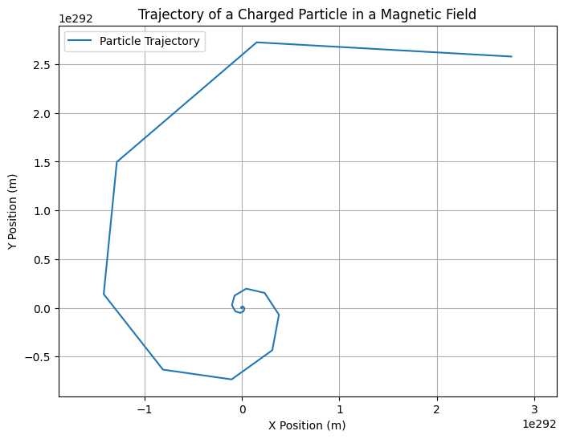

# Problem 1
# Problem 1: Simulating the Effects of the Lorentz Force

## Motivation:

The **Lorentz force** is a fundamental concept governing the motion of charged particles in electric and magnetic fields. It plays a critical role in various applications, including plasma physics, particle accelerators, and astrophysics. By simulating particle motion under the influence of these forces, we can visualize the complex paths that particles take in different field configurations.

---

## Task Overview:

### 1. Exploration of Applications:
   - Identify systems where the Lorentz force is crucial (e.g., particle accelerators, mass spectrometers, plasma confinement).
   - Discuss how **electric (\( \mathbf{E} \))** and **magnetic (\( \mathbf{B} \))** fields influence particle motion.

### 2. Simulating Particle Motion:
   - Implement a simulation to compute and visualize the trajectory of a charged particle under:
     - A uniform magnetic field.
     - Combined uniform electric and magnetic fields.
     - Crossed electric and magnetic fields.

   Simulate the particle’s circular, helical, or drift motion based on the initial conditions and field configurations.

### 3. Parameter Exploration:
   - Allow variations in:
     - Field strengths (\( B \), \( E \))
     - Initial particle velocity (\( \mathbf{v} \))
     - Charge and mass of the particle (\( q \), \( m \))

   Observe how these parameters affect the trajectory.

## The Mathematical Model:

The **Lorentz force** is given by the equation:

$$
\mathbf{F} = q \cdot \left( \mathbf{E} + \mathbf{v} \times \mathbf{B} \right)
$$

Where:
- \( \mathbf{F} \) is the Lorentz force,
- \( q \) is the charge of the particle,
- \( \mathbf{E} \) is the electric field,
- \( \mathbf{v} \) is the velocity of the particle,
- \( \mathbf{B} \) is the magnetic field, and
- \( \times \) represents the **cross product** between velocity and magnetic field.

The motion of the particle is governed by **Newton’s second law**:

$$
m \cdot \frac{d\mathbf{v}}{dt} = \mathbf{F}
$$

Where:
- \( m \) is the mass of the particle,
- \( \frac{d\mathbf{v}}{dt} \) is the acceleration (change in velocity over time).

---

## Python Code: Simulation and Visualization

Below is the Python code used to simulate the motion of a charged particle under a magnetic field and visualize its trajectory. This code uses **Euler's method** for numerical integration:

```python
import numpy as np
import matplotlib.pyplot as plt

# Constants
q = 1.6e-19        # Charge of the particle (Coulombs)
m = 1.67e-27       # Mass of the particle (kg)
B = 1.0            # Magnetic field strength (Tesla)
E = np.array([0.0, 0.0, 0.0])  # Electric field (V/m)
v0 = np.array([1e5, 0, 0])     # Reduced initial velocity (m/s)
r0 = np.array([0, 0, 0])       # Initial position (m)

# Time parameters
t_max = 1e-4        # Total simulation time (seconds) — shortened to reduce instability
dt = 1e-8           # Smaller time step for stability
num_steps = int(t_max / dt)

# Initialize position and velocity arrays
r = np.zeros((num_steps, 3))
v = np.zeros((num_steps, 3))
r[0] = r0
v[0] = v0

# Euler method
for i in range(1, num_steps):
    F = q * (E + np.cross(v[i-1], [0, 0, B]))  # Lorentz force
    a = F / m
    v[i] = v[i-1] + a * dt
    r[i] = r[i-1] + v[i] * dt

# Plot
plt.figure(figsize=(8, 6))
plt.plot(r[:, 0], r[:, 1], label='Particle Trajectory')
plt.title('Trajectory of a Charged Particle in a Magnetic Field')
plt.xlabel('X Position (m)')
plt.ylabel('Y Position (m)')
plt.grid(True)
plt.axis('equal')
plt.legend()
plt.show()
```

```



