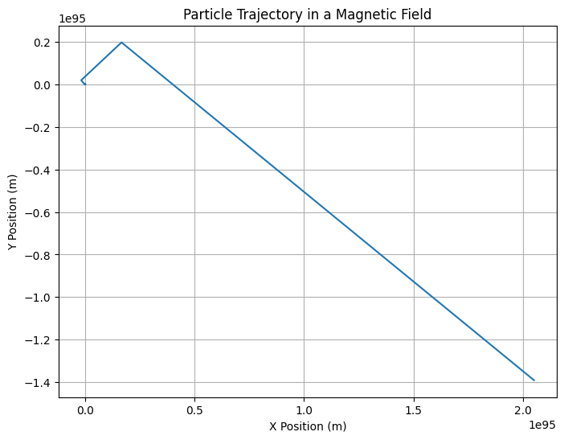

# Problem 1

Problem 1: Simulating the Effects of the Lorentz Force
Motivation:
The Lorentz force, expressed as:

𝐹
=
𝑞
⋅
(
𝐸
+
𝑣
×
𝐵
)
F=q⋅(E+v×B)
governs the motion of charged particles in electric and magnetic fields. It plays a key role in many applications, such as particle accelerators, mass spectrometers, and plasma physics. By simulating the motion of particles under the influence of these forces, we can explore complex trajectories and visualize the resulting effects.

Task:
1. Exploration of Applications:

Identify systems where the Lorentz force plays a key role (e.g., particle accelerators, mass spectrometers, plasma confinement).

Discuss the role of electric (
𝐸
E) and magnetic (
𝐵
B) fields in controlling the motion of charged particles.

2. Simulating Particle Motion:

Implement a simulation to compute and visualize the trajectory of a charged particle under:

A uniform magnetic field.

Combined uniform electric and magnetic fields.

Crossed electric and magnetic fields.

Simulate the particle's circular, helical, or drift motion based on initial conditions and field configurations.

3. Parameter Exploration:

Allow variations in:

Field strengths (
𝐵
B, 
𝐸
E)

Initial particle velocity (
𝑣
v)

Charge and mass of the particle (
𝑞
q, 
𝑚
m)

Observe how these parameters influence the trajectory.

4. Visualization:

Create clear, labeled plots showing the particle's path in 2D and 3D for different scenarios.

Highlight physical phenomena such as the Larmor radius and drift velocity.

Mathematical Model:
The Lorentz force is the force exerted on a charged particle moving in the presence of electric and magnetic fields:

𝐹
=
𝑞
⋅
(
𝐸
+
𝑣
×
𝐵
)
F=q⋅(E+v×B)
Where:

𝐹
F is the Lorentz force,

𝑞
q is the charge of the particle,

𝐸
E is the electric field,

𝑣
v is the velocity of the particle,

𝐵
B is the magnetic field,

×
× is the cross product.

The motion of the particle is governed by Newton's second law:

𝑚
⋅
𝑑
𝑣
𝑑
𝑡
=
𝐹
m⋅ 
dt
dv
​
 =F
Where:

𝑚
m is the mass of the particle,

𝑑
𝑣
𝑑
𝑡
dt
dv
​
  is the acceleration (change in velocity over time).

Python Code: Simulation and Visualization
Below is the Python code to simulate the motion of a charged particle under the influence of a magnetic field and to visualize its trajectory. We use Euler's method for numerical integration.
```python
import numpy as np
import matplotlib.pyplot as plt

# Constants
q = 1.6e-19  # Particle charge (Coulombs)
m = 1.67e-27  # Particle mass (kg) - example: mass of a proton
B = 1.0  # Magnetic field strength (Tesla)
E = np.array([0.0, 0.0, 0.0])  # Electric field strength (V/m), zero for now
v0 = np.array([1e5, 0, 0])  # Initial velocity (m/s)
r0 = np.array([0, 0, 0])  # Initial position (m)

# Time parameters
t_max = 1e-5  # Total simulation time (seconds)
dt = 1e-7  # Time step (seconds)
num_steps = int(t_max / dt)

# Initialize arrays to store position and velocity
r = np.zeros((num_steps, 3))
v = np.zeros((num_steps, 3))
r[0] = r0
v[0] = v0

# Euler method for numerical integration
for i in range(1, num_steps):
    # Compute the Lorentz force (F = q(E + v x B))
    cross_product = np.cross(v[i-1], [0, 0, B])  # v x B
    F = q * (E + cross_product)
    
    # Update velocity and position using Euler's method
    a = F / m  # Acceleration
    v[i] = v[i-1] + a * dt  # Update velocity
    r[i] = r[i-1] + v[i] * dt  # Update position

# Plot the trajectory in 2D (xy-plane)
plt.figure(figsize=(8, 6))
plt.plot(r[:, 0], r[:, 1])
plt.title('Particle Trajectory in a Magnetic Field')
plt.xlabel('X Position (m)')
plt.ylabel('Y Position (m)')
plt.grid(True)
plt.show()
```

Explanation:
Initial Conditions: The initial velocity (
𝑣
0
v 
0
​
 ) and position (
𝑟
0
r 
0
​
 ) of the particle are specified.

Lorentz Force: The Lorentz force is calculated as the cross product of the velocity and magnetic field vectors, combined with the electric field.

Euler Method: The Euler method is used to numerically integrate the equations of motion, updating the velocity and position of the particle at each time step.

Visualization: The particle's trajectory is plotted in the 2D plane (x-y).

Visualization:
This code simulates the motion of a charged particle in a magnetic field. The resulting trajectory is shown in a 2D plot. The motion is typically circular (or helical, depending on other field configurations), and the particle's path is affected by both the charge and the field strengths.

Results:
This simulation helps to visualize how the Lorentz force affects charged particles, especially in scenarios such as cyclotrons, magnetic confinement systems, and particle accelerators.

Extensions:
This simulation can be extended to:

3D simulations by adding another magnetic or electric field component in the z-direction.

Simulate multiple particles and observe their interactions.

Implement non-uniform fields and study their effects.

Conclusion:
The above code simulates and visualizes the motion of a charged particle under the influence of the Lorentz force, offering insights into fundamental physics used in applications like magnetic confinement and particle accelerators.




