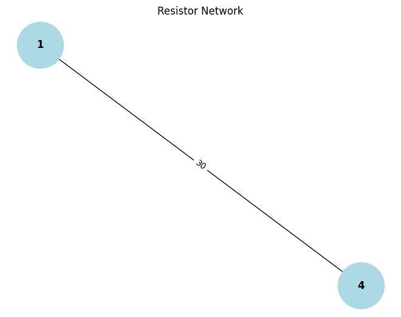

# Problem 1
## ⚡ Equivalent Resistance Using Graph Theory

---

### 🎯 Motivation

Calculating equivalent resistance is a fundamental task in circuit analysis. While applying series and parallel rules manually works for simple circuits, it quickly becomes impractical for **complex networks**.

**Graph theory** provides a powerful and structured approach:

- **Nodes** ⟶ Circuit junctions  
- **Edges** ⟶ Resistors (edge weights = resistance values)

This representation enables algorithmic simplification and is ideal for:
- Circuit simulation
- Optimization problems
- Automated analysis tools

Graph-based methods not only streamline calculations but also deepen our understanding of the **relationship between math and physics**.

---

## 🧠 Task Options

---

### ✅ Option 1: Simplified Task – Algorithm Description

Describe an algorithm that calculates the equivalent resistance using graph simplification:

#### 📌 Goals:
- Detect and reduce **series** and **parallel** resistor combinations.
- Continue until the graph reduces to a single edge between two terminals.


#### 💡 Nested Combination Handling

- **Series** detection uses degree-2 internal nodes.
- **Parallel** detection identifies multiple edges between the same node pair.
- Repeat until only one edge remains between terminals.

---

### 🧑‍💻 Implementation (Python)

Below is a Python implementation.
```python
import matplotlib.pyplot as plt
import networkx as nx

# Function to reduce the resistor network graph
def reduce_circuit(G, start, end):
    """
    Reduces a resistor circuit graph by combining series and parallel resistors.
    Returns the equivalent resistance between the start and end nodes.
    
    Parameters:
        G (networkx.Graph): The circuit graph with 'resistance' as edge attribute.
        start (hashable): The starting node of the circuit.
        end (hashable): The ending node of the circuit.
    
    Returns:
        float: The equivalent resistance between start and end nodes.
    """
    changed = True
    while changed:
        changed = False

        # Handle series connections (where two resistors are in series)
        for node in list(G.nodes()):
            if node not in (start, end) and G.degree[node] == 2:
                neighbors = list(G.neighbors(node))
                if G.has_edge(node, neighbors[0]) and G.has_edge(node, neighbors[1]):
                    r1 = G[node][neighbors[0]]['resistance']
                    r2 = G[node][neighbors[1]]['resistance']
                    R_eq = r1 + r2
                    G.add_edge(neighbors[0], neighbors[1], resistance=R_eq)
                    G.remove_node(node)
                    changed = True
                    break

        # Handle parallel connections (where two resistors are in parallel)
        parallel_edges = {}
        for u, v, data in list(G.edges(data=True)):
            key = tuple(sorted((u, v)))
            parallel_edges.setdefault(key, []).append(data['resistance'])

        for (u, v), resistors in parallel_edges.items():
            if len(resistors) > 1:
                R_eq = 1 / sum(1 / r for r in resistors)
                G.remove_edges_from([(u, v)])
                G.add_edge(u, v, resistance=R_eq)
                changed = True
                break

    # Print the final equivalent resistance between start and end nodes
    print(f"Equivalent resistance between {start} and {end}: {G[start][end]['resistance']} Ω")
    return G[start][end]['resistance']


# Create a sample resistor network (graph)
G = nx.Graph()
G.add_edge(1, 2, resistance=5)   # 5Ω between nodes 1 and 2
G.add_edge(2, 3, resistance=10)  # 10Ω between nodes 2 and 3
G.add_edge(3, 4, resistance=15)  # 15Ω between nodes 3 and 4
G.add_edge(1, 4, resistance=20)  # 20Ω between nodes 1 and 4

# Reduce the circuit and find the equivalent resistance between nodes 1 and 4
reduce_circuit(G, 1, 4)

# Visualize the graph
pos = nx.spring_layout(G)
nx.draw(G, pos, with_labels=True, node_color='lightblue', font_weight='bold', node_size=3000)
edge_labels = nx.get_edge_attributes(G, 'resistance')
nx.draw_networkx_edge_labels(G, pos, edge_labels=edge_labels)
plt.title("Resistor Network")
plt.show()
```


### 🧪 Example Inputs

Two resistors in **series**:

- **R₁ = 5 Ω**  
- **R₂ = 10 Ω**

**Total Resistance**:  
**Rₑq = R₁ + R₂ = 5 + 10 = 15 Ω**

⚙️ Efficiency & Improvements
The current algorithm is suitable for small to medium-sized circuits, especially those composed of clear series and parallel combinations.

For larger and more complex graphs, consider the following enhancements:

Union-Find (Disjoint Set Union - DSU):
Useful for efficiently identifying and merging connected components during simplification, especially when analyzing multiple parallel branches.

Laplacian Matrix + Kirchhoff’s Laws:
For arbitrary and highly connected networks, applying Kirchhoff’s Current and Voltage Laws using the graph Laplacian enables precise analysis through linear algebra. This method scales better and is ideal for automated circuit solvers and simulations.

These improvements enable more robust and scalable solutions, especially when dealing with real-world electrical networks or integrating circuit analysis into larger computational systems.
