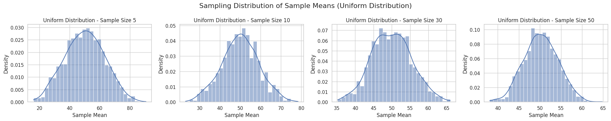
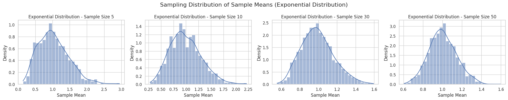
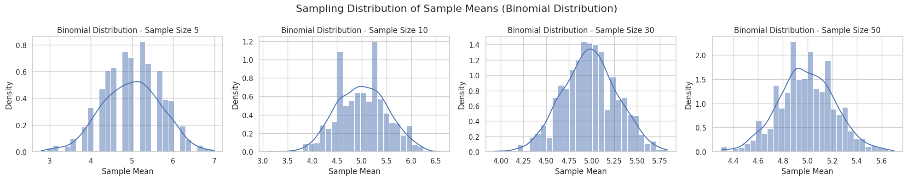

# Problem 1

# 🧠 central limit theorem - motivation
# --------------------------------------------------
# the central limit theorem (clt) states that regardless of the shape 
# of the population distribution, the sampling distribution of the sample mean 
# will approximate a normal distribution as the sample size becomes large enough.

# 🔑 key points:
# - works for any original distribution (uniform, exponential, binomial, etc.).
# - the rate of convergence depends on the sample size and the population’s variance.

# 📊 simulating sampling distributions
# --------------------------------------------------
# we will use 3 types of population distributions:
# - uniform distribution (evenly spread)
# - exponential distribution (skewed right)
# - binomial distribution (discrete distribution)

# for each distribution:
# - generate a large "population" (size = 100,000).
# - sample different sample sizes (5, 10, 30, 50).
# - repeat 1000 times per sample size.

# 🔍 parameter exploration
# --------------------------------------------------
# observations:
# - uniform distribution: already somewhat symmetric. converges quickly to normality even with small sample sizes.
# - exponential distribution: highly skewed. needs larger sample sizes (around 30–50) for the sample mean distribution to become approximately normal.
# - binomial distribution: symmetric when p ≈ 0.5. convergence is faster compared to skewed distributions.

# impact of population variance:
# - populations with higher variance (like exponential) cause the sampling distribution to be wider (more spread out).
# - larger sample sizes reduce the spread (standard error decreases as 1 / √n).

# 🛠️ practical applications
# --------------------------------------------------
# why is the clt important?
# - estimating population parameters: enables us to use the normal distribution for confidence intervals even if the population isn't normal.
# - quality control: detects anomalies in manufacturing processes by looking at averages.
# - finance: predicts returns or risks by aggregating lots of small random events.


2. Python Code

```python
import numpy as np
import matplotlib.pyplot as plt
# Set style
sns.set(style="whitegrid")

# Define population sizes and sample sizes
population_size = 100_000
sample_sizes = [5, 10, 30, 50]
repeats = 1000

# Function to create sampling distribution
def sampling_distribution(population, sample_size, repeats):
    means = []
    for _ in range(repeats):
        sample = np.random.choice(population, size=sample_size, replace=False)
        means.append(np.mean(sample))
    return means

# Function to plot sampling distributions
def plot_sampling_distributions(population, pop_name):
    fig, axes = plt.subplots(1, len(sample_sizes), figsize=(20, 4))
    
    for idx, size in enumerate(sample_sizes):
        sample_means = sampling_distribution(population, size, repeats)
        sns.histplot(sample_means, kde=True, ax=axes[idx], stat="density", bins=30)
        axes[idx].set_title(f"{pop_name} - Sample Size {size}")
        axes[idx].set_xlabel("Sample Mean")
        axes[idx].set_ylabel("Density")
    
    fig.suptitle(f"Sampling Distribution of Sample Means ({pop_name})", fontsize=16)
    plt.tight_layout()
    plt.show()
    ```






# ===========================================
# 3. Parameter Exploration
# ===========================================

# Observations:
# -----------------------------
# - Uniform Distribution:
#   - Already somewhat symmetric.
#   - Converges quickly to normality even with small sample sizes.
#
# - Exponential Distribution:
#   - Highly skewed.
#   - Needs larger sample sizes (around 30–50) for the sample mean distribution to become approximately normal.
#
# - Binomial Distribution:
#   - Symmetric when p ≈ 0.5.
#   - Convergence is faster compared to skewed distributions.

# Impact of Population Variance:
# -----------------------------
# - Populations with higher variance (like exponential) cause the sampling distribution to be wider (more spread out).
# - Larger sample sizes reduce the spread (standard error decreases as 1 / √n).

# ===========================================
# 4. Practical Applications
# ===========================================

# Why is the CLT important?
# -----------------------------
# - Estimating population parameters:
#   - Enables us to use the normal distribution for confidence intervals even if the population isn't normal.
#
# - Quality control:
#   - Detects anomalies in manufacturing processes by looking at averages.
#
# - Finance:
#   - Predicts returns or risks by aggregating lots of small random events.
