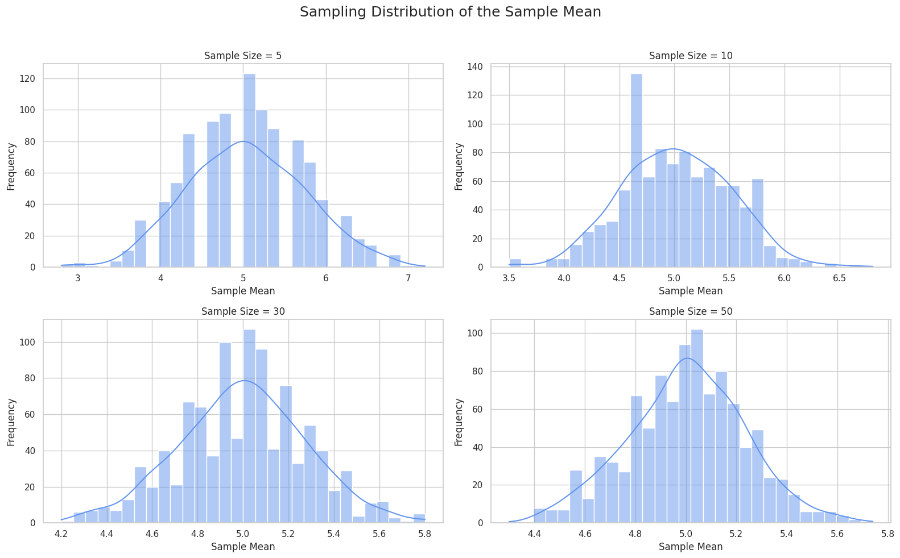

# Problem 1
# 📊 Exploring the Central Limit Theorem through Simulations

---

## 🎯 Motivation

The **Central Limit Theorem (CLT)** is a key idea in statistics. It says that the **sampling distribution of the sample mean** will become approximately **normal**, even if the original population is not — as long as the sample size is large enough.

This simulation-based approach helps us understand how and why this works.

---

## 🧪 1. Simulating Sampling Distributions

We use different population types to demonstrate the CLT:

- 🟦 Uniform Distribution
- 📈 Exponential Distribution
- ⚪ Binomial Distribution

Each distribution is used to generate a large synthetic dataset.

---

## 📉 2. Sampling and Visualization

For each distribution, we:

- Choose sample sizes: **5, 10, 30, 50**
- Randomly draw samples and calculate their means
- Repeat 1000 times to build a sampling distribution
- Plot histograms to observe how they approach a normal shape

---

### 💻 Python Code

```python
import numpy as np
import matplotlib.pyplot as plt
import seaborn as sns

sns.set(style="whitegrid")

def simulate_clt(population_func, pop_params, sample_sizes, n_simulations=1000):
    plt.figure(figsize=(16, 10))
    
    for i, n in enumerate(sample_sizes):
        sample_means = []
        for _ in range(n_simulations):
            sample = population_func(size=n, **pop_params)
            sample_means.append(np.mean(sample))
        
        plt.subplot(2, 2, i + 1)
        sns.histplot(sample_means, bins=30, kde=True, color="cornflowerblue")
        plt.title(f"Sample Size = {n}")
        plt.xlabel("Sample Mean")
        plt.ylabel("Frequency")
    
    plt.suptitle("Sampling Distribution of the Mean", fontsize=18)
    plt.tight_layout(rect=[0, 0, 1, 0.96])
    plt.show()

sample_sizes = [5, 10, 30, 50]

print("🟦 Uniform Distribution")
simulate_clt(np.random.uniform, {'low': 0, 'high': 10}, sample_sizes)

print("📈 Exponential Distribution")
simulate_clt(np.random.exponential, {'scale': 2.0}, sample_sizes)

print("⚪ Binomial Distribution")
simulate_clt(np.random.binomial, {'n': 10, 'p': 0.5}, sample_sizes)



🔬 3. Parameter Exploration
🧷 Shape of Original Distribution
Uniform is already symmetric → fast convergence to normality.

Exponential is skewed → still becomes normal with larger samples.

Binomial is discrete → smooths out with increased sample size.

🧮 Impact of Sample Size
As sample size increases:

The variance of the sample mean decreases

The distribution of the mean becomes more concentrated around the true mean

Results become more predictable and stable

🌍 4. Practical Applications
The CLT is widely used in:

📏 Estimating unknown population parameters

🏭 Quality control and manufacturing checks

💼 Risk modeling and finance

📊 Survey analysis and polling

It allows us to use small samples to make big conclusions — safely.

📦 Deliverables
✅ Python code or Jupyter Notebook simulations

✅ Histograms for each sample size and distribution

✅ Discussion on the results and theory of CLT

🧠 Conclusion
The Central Limit Theorem shows us that averages behave predictably — even when the underlying data does not. This makes it one of the most powerful tools in all of statistics and data science.

“The average of the averages is almost always normal.” 🌐


