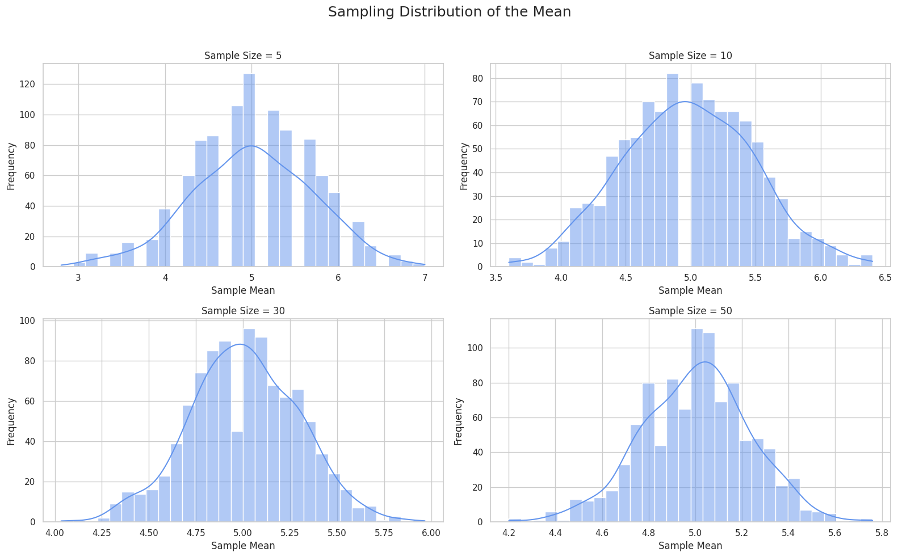

# Problem 1
# 📊 Exploring the Central Limit Theorem through Simulations

---

## 🎯 Motivation

The **Central Limit Theorem (CLT)** is a cornerstone of probability and statistics. It states that the sampling distribution of the sample mean approaches a **normal distribution** as the sample size increases, regardless of the original population’s distribution. Simulations provide an intuitive, hands-on way to observe this phenomenon in action and help understand how randomness behaves in the long run.

---

## 1️⃣ Simulating Sampling Distributions

We begin by selecting various population distributions:

- **Uniform Distribution**
- **Exponential Distribution**
- **Binomial Distribution**

For each distribution, we generate a large synthetic population dataset using NumPy.

---

## 2️⃣ Sampling and Visualization

We randomly sample data from the population and calculate the **sample mean** for different sample sizes:

- Sample sizes: **5, 10, 30, 50**

Each sampling process is repeated multiple times (e.g., 1000 times) to construct the **sampling distribution of the sample mean**.

The results are visualized using histograms to observe how the shape of the distribution evolves with sample size.

```python
import numpy as np
import matplotlib.pyplot as plt
import seaborn as sns

sns.set(style="whitegrid")

# Simulation function
def simulate_clt(population_func, pop_params, sample_sizes, n_simulations=1000):
    plt.figure(figsize=(16, 10))
    
    for i, n in enumerate(sample_sizes):
        sample_means = []
        for _ in range(n_simulations):
            sample = population_func(size=n, **pop_params)
            sample_means.append(np.mean(sample))
        
        plt.subplot(2, 2, i + 1)
        sns.histplot(sample_means, bins=30, kde=True, color="cornflowerblue")
        plt.title(f"Sample Size = {n}")
        plt.xlabel("Sample Mean")
        plt.ylabel("Frequency")
    
    plt.suptitle("Sampling Distribution of the Mean", fontsize=18)
    plt.tight_layout(rect=[0, 0, 1, 0.96])
    plt.show()

# Sample sizes to try
sample_sizes = [5, 10, 30, 50]

# Uniform distribution
print("🔹 Uniform Distribution")
simulate_clt(np.random.uniform, {'low': 0, 'high': 10}, sample_sizes)

# Exponential distribution
print("🔹 Exponential Distribution")
simulate_clt(np.random.exponential, {'scale': 2.0}, sample_sizes)

# Binomial distribution
print("🔹 Binomial Distribution")
simulate_clt(np.random.binomial, {'n': 10, 'p': 0.5}, sample_sizes)
```



3️⃣ Parameter Exploration
🔍 Shape and Convergence

Distributions like the Exponential are initially skewed, but the mean's sampling distribution becomes more symmetric with larger sample sizes.
The Uniform distribution converges more quickly since it's already symmetric.
The Binomial distribution, being discrete, smooths out with increasing n.

🔍 Variance Impact

The spread (standard deviation) of the sampling distribution decreases as sample size increases.
This reflects the law of large numbers: larger samples yield more stable, accurate estimates of the population mean.

4️⃣ Practical Applications
The CLT plays a vital role in many fields:

📏 Estimating population parameters from small samples.
🏭 Quality control: detecting anomalies in manufacturing processes.
💹 Finance: modeling and forecasting market averages or risks.
Understanding the CLT helps in making informed decisions even under uncertainty, by using averages from random samples.

📦 Deliverables

✅ Python simulation scripts and/or notebooks.
✅ Histograms showing the convergence to a normal distribution.
✅ Explanatory discussion linking results with CLT theory.


