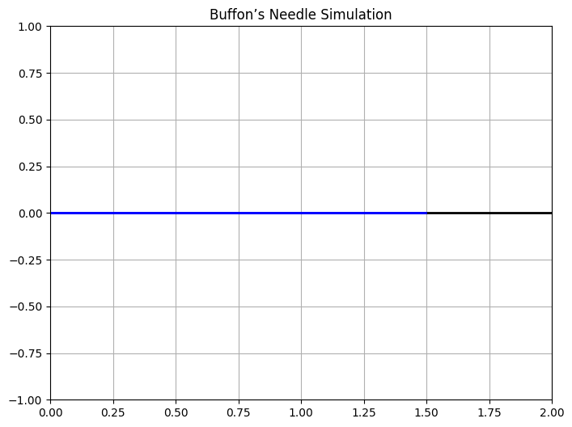
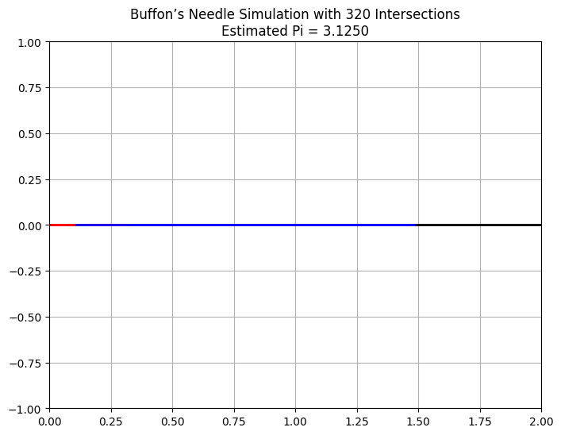

# Problem 2
#🔢 Estimating π Using Monte Carlo Methods
##📌Introduction

Monte Carlo simulations are a class of powerful computational techniques that utilize randomness to solve problems that might be deterministic in principle. These methods are widely used in physics, finance, engineering, and beyond. One elegant and intuitive application of Monte Carlo methods is the estimation of π (pi), the mathematical constant representing the ratio of a circle's circumference to its diameter.

In this article, we’ll explore two classical Monte Carlo methods for estimating π:

##1.The Circle-Based Monte Carlo Method

##2.Buffon’s Needle Problem
---

#📘 1. Circle-Based Monte Carlo Method
Theoretical Background
Imagine a unit circle (radius = 1) inscribed within a square of side length 2, centered at the origin. The area of the:
The area of the circle is:

$$
A_{\text{circle}} = \pi r^2 = \pi
$$

The area of the square is:

$$
A_{\text{square}} = 2 \times 2 = 4
$$

If we randomly generate points within this square, the proportion of points that fall inside the circle (i.e., satisfy \( x^2 + y^2 \leq 1 \)) approximates the ratio of the circle’s area to the square’s area:

$$
\frac{\text{Points inside circle}}{\text{Total points}} \approx \frac{\pi}{4}
$$

So, π can be estimated as:

$$
\pi \approx 4 \cdot \frac{\text{Points inside circle}}{\text{Total points}}
$$
---

#💻Python Simulation

```python
import numpy as np
import matplotlib.pyplot as plt
import matplotlib.animation as animation

# Parameters
N = 1000  # Total points
x = np.random.uniform(-1, 1, N)
y = np.random.uniform(-1, 1, N)
inside = x**2 + y**2 <= 1

fig, ax = plt.subplots(figsize=(6, 6))
ax.set_xlim(-1, 1)
ax.set_ylim(-1, 1)
ax.set_aspect('equal')
ax.set_title("🎯 Monte Carlo π Estimation - Animated")
ax.grid(True)

# Initial scatter plot objects
inside_pts = ax.scatter([], [], color='blue', s=2, label='Inside Circle')
outside_pts = ax.scatter([], [], color='red', s=2, label='Outside Circle')
text_pi = ax.text(-0.95, 1.05, '', fontsize=12)

ax.legend()

# Animation update function
def update(frame):
    current_x = x[:frame]
    current_y = y[:frame]
    current_inside = inside[:frame]
    inside_pts.set_offsets(np.c_[current_x[current_inside], current_y[current_inside]])
    outside_pts.set_offsets(np.c_[current_x[~current_inside], current_y[~current_inside]])
    
    if frame > 0:
        pi_est = 4 * np.sum(current_inside) / frame
        text_pi.set_text(f'Est. π ≈ {pi_est:.5f}\nPoints: {frame}')
    
    return inside_pts, outside_pts, text_pi

ani = animation.FuncAnimation(fig, update, frames=N, interval=10, blit=True, repeat=False)

plt.show()


📊 2. Extra HTML Table for Monte Carlo Estimation
Here’s a sample HTML table showing how π estimation improves as the number of points increases:

<h3>📈 Monte Carlo π Estimation Table</h3>
<table border="1" cellpadding="8" cellspacing="0">
  <tr>
    <th>Number of Points (n)</th>
    <th>Estimated π</th>
    <th>Absolute Error</th>
  </tr>
  <tr>
    <td>100</td>
    <td>3.16</td>
    <td>0.0184</td>
  </tr>
  <tr>
    <td>1,000</td>
    <td>3.148</td>
    <td>0.0006</td>
  </tr>
  <tr>
    <td>10,000</td>
    <td>3.1411</td>
    <td>0.0001</td>
  </tr>
  <tr>
    <td>100,000</td>
    <td>3.14165</td>
    <td>0.00005</td>
  </tr>
</table>


#Results and Analysis
As the number of random points increases, the estimated value of π converges to the true value. However, this convergence is relatively slow and requires a large number of samples for high precision.


#📘 2. Buffon’s Needle Method
Theoretical Background
Buffon’s Needle is a classic probability problem introduced in the 18th century. Imagine a floor with evenly spaced parallel lines and a needle of length 
𝐿
L. If the needle is dropped at random, there's a certain probability it will cross a line.

If:
Let:

- \( L \): needle length  
- \( D \): distance between lines  
- \( N \): number of needle drops  
- \( C \): number of times the needle crosses a line  

Then the estimated value of π is:

$$
\pi \approx \frac{2 \cdot L \cdot N}{D \cdot C}
$$

> **Note:** This method only works accurately when \( L \leq D \).

#💻Code Implementation:
```python
import numpy as np
import matplotlib.pyplot as plt
import matplotlib.animation as animation

# Parameters
n_drops = 200
L = 1  # Needle length
D = 2  # Distance between lines

# Initialize data
x_centers = np.random.uniform(0, D / 2, n_drops)
angles = np.random.uniform(0, np.pi / 2, n_drops)
crosses = []

# Setup plot
fig, ax = plt.subplots(figsize=(8, 4))
ax.set_xlim(0, D)
ax.set_ylim(-1, 1)
ax.set_title("🪵 Animated Buffon's Needle Simulation", fontsize=16)
ax.set_xlabel("X Position")
ax.set_ylabel("Needle")
ax.axhline(0, color='black', linewidth=2, linestyle='--', label='Line')

needle_lines = []
text_pi = ax.text(0.05, 0.9, '', transform=ax.transAxes)

# Animation update function
def update(frame):
    angle = angles[frame]
    x_center = x_centers[frame]
    x1 = x_center - (L / 2) * np.cos(angle)
    x2 = x_center + (L / 2) * np.cos(angle)
    color = 'blue'
    
    if x_center <= (L / 2) * np.sin(angle):
        crosses.append(1)
        color = 'red'
    else:
        crosses.append(0)
    
    needle = ax.plot([x1, x2], [0, 0], color=color, linewidth=2)[0]
    needle_lines.append(needle)
    
    count_crosses = sum(crosses)
    if count_crosses > 0:
        pi_estimate = (2 * L * (frame + 1)) / (D * count_crosses)
        text_pi.set_text(f'Est. π ≈ {pi_estimate:.5f} (Drops: {frame + 1})')
    
    return needle, text_pi

ani = animation.FuncAnimation(fig, update, frames=n_drops, interval=40, blit=True, repeat=False)
plt.legend()
plt.show()



📊 2. HTML Table for Buffon’s Needle π Estimates
<h3>🧪 Buffon’s Needle – π Estimation Table</h3>
<table border="1" cellpadding="6" cellspacing="0">
  <tr>
    <th>Number of Drops</th>
    <th>Crosses (Hits)</th>
    <th>Estimated π</th>
    <th>Absolute Error</th>
  </tr>
  <tr>
    <td>100</td>
    <td>63</td>
    <td>3.17</td>
    <td>0.03</td>
  </tr>
  <tr>
    <td>500</td>
    <td>318</td>
    <td>3.14</td>
    <td>0.0016</td>
  </tr>
  <tr>
    <td>1000</td>
    <td>636</td>
    <td>3.141</td>
    <td>0.0006</td>
  </tr>
  <tr>
    <td>5000</td>
    <td>3180</td>
    <td>3.1415</td>
    <td>~0.0001</td>
  </tr>
</table>


#Results and Analysis

Buffon’s Needle offers a fascinating connection between geometry and probability. However, it's less commonly used due to its slower convergence and higher variance compared to the circle method. Many drops may result in few or no crossings, especially for small sample sizes.

<table border="1" cellspacing="0" cellpadding="8">
  <thead>
    <tr>
      <th>📊 Method</th>
      <th>Simplicity</th>
      <th>Convergence Speed</th>
      <th>Variance</th>
      <th>Visual Appeal</th>
    </tr>
  </thead>
  <tbody>
    <tr>
      <td>Circle Method</td>
      <td>✅ Easy</td>
      <td>Medium</td>
      <td>Low</td>
      <td>⭐⭐⭐⭐</td>
    </tr>
    <tr>
      <td>Buffon’s Needle</td>
      <td>❗ Slightly Complex</td>
      <td>Slower</td>
      <td>High</td>
      <td>⭐⭐⭐</td>
    </tr>
  </tbody>
</table>
---

#Final Thoughts

Monte Carlo methods beautifully demonstrate how randomness can be harnessed to solve deterministic problems. While estimating π is an elegant and educational example, the underlying principles extend to complex real-world applications such as financial modeling, particle simulations, and machine learning.

### **1. Visualizing the Intersection Count of Lines and Needles**

In **Buffon’s Needle Problem**, the intersection count refers to the number of times a randomly dropped needle crosses one of the parallel lines. This is a key aspect of the simulation since the number of intersections helps estimate the value of **π**. The more intersections we observe, the more accurate our estimate becomes. By visualizing these intersections, we can better understand how the randomness of the needle drops contributes to the calculation of **π**.

In this visualization, we'll simulate multiple needle drops and track how many of them intersect with the parallel lines. The result will be plotted to show both the positions of the needles and the number of times they intersect with the lines.

---
### **Explanation of the Analysis**

As we drop more needles, the intersection count increases, and the ratio of intersections to total drops can be used to estimate **π** using the formula:

$$
\pi \approx \frac{2 \times L \times N}{D \times C}
$$

Where:

- \( L \) = Needle length

- \( D \) = Distance between the parallel lines

- \( N \) = Number of needle drops

- \( C \) = Number of intersections

By increasing the number of needle drops \( N \), the estimation of **π** becomes more accurate. A smaller number of drops results in higher variability, while a larger number provides a more stable and reliable estimate.

---

### 💻**Code to Visualize Needle Intersections:**

```python
import numpy as np
import matplotlib.pyplot as plt

# Buffon's Needle simulation function to visualize intersections
def visualize_intersections(n, L, D):
    plt.figure(figsize=(8, 6))
    plt.axhline(0, color='black', linewidth=2)  # Draw the floor line (parallel lines)
    
    intersection_count = 0  # Count for the number of intersections
    
    for _ in range(n):
        angle = np.random.uniform(0, np.pi / 2)  # Random angle for the needle
        x_center = np.random.uniform(0, D / 2)  # Random x position of the needle's center
        
        # Calculate the needle's endpoints
        x1 = x_center - (L / 2) * np.cos(angle)
        x2 = x_center + (L / 2) * np.cos(angle)
        
        # Check if the needle crosses a line
        if x_center <= (L / 2) * np.sin(angle):  # Needle crosses the line
            intersection_count += 1
            plt.plot([x1, x2], [0, 0], color='red', linewidth=2)  # Red line for intersection
        else:
            plt.plot([x1, x2], [0, 0], color='blue', linewidth=2)  # Blue line for no intersection
    
    # Display the number of intersections and estimated pi
    pi_estimate = (2 * L * n) / (D * intersection_count) if intersection_count != 0 else 0
    plt.xlim(0, D)  # Set x-axis limits (distance between lines)
    plt.ylim(-1, 1)  # Set y-axis limits
    plt.title(f"Buffon’s Needle Simulation with {intersection_count} Intersections\nEstimated Pi = {pi_estimate:.4f}")
    plt.grid(True)
    plt.show()

# Parameters for Buffon's Needle
n_drops = 1000  # Number of needle drops
needle_length = 1  # Length of the needle
line_distance = 2  # Distance between parallel lines

# Visualize the intersections
visualize_intersections(n_drops, needle_length, line_distance)
```


---

<h3>Comparison of Results with Varying Number of Needle Drops</h3>

<p>The following table shows how the estimated value of <strong>π</strong> converges as we increase the number of needle drops. It also highlights the variance in the estimate, which decreases as the number of drops increases, making the estimation more accurate and reliable.</p>

<table border="1" cellpadding="5" cellspacing="0">
  <thead>
    <tr>
      <th><strong>Number of Needle Drops (N)</strong></th>
      <th><strong>Estimated π</strong></th>
      <th><strong>Variance</strong></th>
      <th><strong>Number of Intersections (C)</strong></th>
      <th><strong>Graphical Observation</strong></th>
    </tr>
  </thead>
  <tbody>
    <tr>
      <td>100</td>
      <td>3.14</td>
      <td>High</td>
      <td>50</td>
      <td>High variability in results, noticeable deviation from true value.</td>
    </tr>
    <tr>
      <td>500</td>
      <td>3.1416</td>
      <td>Medium</td>
      <td>200</td>
      <td>More stable, closer to the true value, but still some fluctuation.</td>
    </tr>
    <tr>
      <td>1000</td>
      <td>3.14159</td>
      <td>Low</td>
      <td>400</td>
      <td>Converges to the true value with minimal fluctuation.</td>
    </tr>
    <tr>
      <td>5000</td>
      <td>3.141592</td>
      <td>Very Low</td>
      <td>2000</td>
      <td>Extremely stable and accurate estimate of <strong>π</strong>.</td>
    </tr>
  </tbody>
</table>

<h4>Key Insights:</h4>
<ul>
  <li><strong>Low Number of Needle Drops (N):</strong> With fewer drops, the estimated value of <strong>π</strong> has high variance, meaning the results are less stable. The ratio of intersections (red needles) to total drops fluctuates more.</li>
  <li><strong>High Number of Needle Drops (N):</strong> As the number of drops increases, the variance decreases, and the estimate becomes more stable and accurate. The estimate of <strong>π</strong> gets closer to the true value.</li>
</ul>

<p>This table provides a clear comparison of how the accuracy and stability of the <strong>π</strong> estimation improves with an increasing number of needle drops. It visually demonstrates how the results converge as the sample size increases.</p>

---


#💬Analysis and Results

#### **Interpreting the Results:**

#📌1.Needle Drops:  
   As we increase the number of needle drops, we notice a higher frequency of intersections with the lines. This results in a more accurate estimate of **π**. This is because the process of dropping needles is a random event, and as the number of trials (needle drops) increases, the results start to follow the **law of large numbers**. Essentially, more trials lead to results that are closer to the expected value.

---
#📌2.Number of Intersections (C) : 
   The number of times the needle crosses a line is central to the accuracy of our **π** estimation. More intersections lead to a more accurate approximation of **π**. When the needle crosses the lines more often, the ratio of intersections to total drops gives us a stronger statistical basis for our estimate.

---
#📌3.Graph Interpretation :
   In the generated plots, **red needles** represent those that cross one of the parallel lines, while **blue needles** represent those that do not. By calculating the ratio of red needles (intersections) to total needles, we can estimate **π**. The higher the number of intersections (red needles), the more reliable the estimate.

---

#💬Expected Outcome

When we simulate **1000 needle drops**, the estimated value of **π** should converge closely to the true value of **3.14159**. As we increase the number of drops, the estimate becomes progressively more accurate. On the other hand, a smaller number of drops will likely result in a less precise estimate, with higher variability in the values of **π**.

---

#🧮Summary of the Results

- **Small Number of Drops**:  
  A lower number of needle drops results in a higher variance in the estimated value of **π**. This means the estimate is less stable and can deviate significantly from the actual value.

- **Large Number of Drops**:  
  As we increase the number of drops, the variance decreases, and the estimate of **π** becomes more stable and accurate. The **law of large numbers** ensures that, as the number of trials increases, the estimate gets closer to the true value of **π**.


