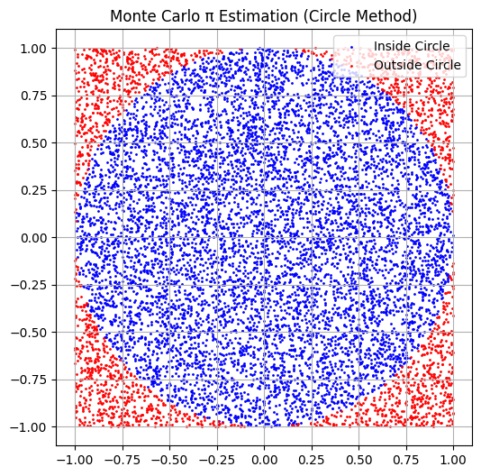

# Problem 2
#🔢 Estimating π Using Monte Carlo Methods
Introduction

Monte Carlo simulations are a class of powerful computational techniques that utilize randomness to solve problems that might be deterministic in principle. These methods are widely used in physics, finance, engineering, and beyond. One elegant and intuitive application of Monte Carlo methods is the estimation of π (pi), the mathematical constant representing the ratio of a circle's circumference to its diameter.

In this article, we’ll explore two classical Monte Carlo methods for estimating π:

##1.The Circle-Based Monte Carlo Method

##2.Buffon’s Needle Problem

#📘 1. Circle-Based Monte Carlo Method
Theoretical Background
Imagine a unit circle (radius = 1) inscribed within a square of side length 2, centered at the origin. The area of the:
The area of the circle is:

$$
A_{\text{circle}} = \pi r^2 = \pi
$$

The area of the square is:

$$
A_{\text{square}} = 2 \times 2 = 4
$$

If we randomly generate points within this square, the proportion of points that fall inside the circle (i.e., satisfy \( x^2 + y^2 \leq 1 \)) approximates the ratio of the circle’s area to the square’s area:

$$
\frac{\text{Points inside circle}}{\text{Total points}} \approx \frac{\pi}{4}
$$

So, π can be estimated as:

$$
\pi \approx 4 \cdot \frac{\text{Points inside circle}}{\text{Total points}}
$$

#Python Simulation

```python
import numpy as np
import matplotlib.pyplot as plt

# Function to estimate Pi using Monte Carlo method
def monte_carlo_pi(n):
    x = np.random.uniform(-1, 1, n)
    y = np.random.uniform(-1, 1, n)
    inside = x**2 + y**2 <= 1
    pi_approx = 4 * np.sum(inside) / n
    return pi_approx, x, y, inside

# Visualization function
def visualize_circle(x, y, inside):
    plt.figure(figsize=(6,6))
    plt.scatter(x[inside], y[inside], color='blue', s=1, label='Inside Circle')
    plt.scatter(x[~inside], y[~inside], color='red', s=1, label='Outside Circle')
    plt.title("Monte Carlo π Estimation (Circle Method)")
    plt.gca().set_aspect('equal')
    plt.grid(True)
    plt.legend()
    plt.show()

# Number of points for the simulation
n = 10000

# Estimate Pi and get the points and inside condition
pi_estimate, x, y, inside = monte_carlo_pi(n)

# Print the estimated value of Pi
print(f"Estimated Pi: {pi_estimate}")

# Visualize the points
visualize_circle(x, y, inside)
```


#Results and Analysis
As the number of random points increases, the estimated value of π converges to the true value. However, this convergence is relatively slow and requires a large number of samples for high precision.

#📘 2. Buffon’s Needle Method
Theoretical Background
Buffon’s Needle is a classic probability problem introduced in the 18th century. Imagine a floor with evenly spaced parallel lines and a needle of length 
𝐿
L. If the needle is dropped at random, there's a certain probability it will cross a line.

If:
Let:

- \( L \): needle length  
- \( D \): distance between lines  
- \( N \): number of needle drops  
- \( C \): number of times the needle crosses a line  

Then the estimated value of π is:

$$
\pi \approx \frac{2 \cdot L \cdot N}{D \cdot C}
$$

> **Note:** This method only works accurately when \( L \leq D \).

#Code Implementation:
```python
import numpy as np
import matplotlib.pyplot as plt

def buffons_needle(n, L, D):
    C = 0
    for _ in range(n):
        angle = np.random.uniform(0, np.pi / 2)
        x_center = np.random.uniform(0, D / 2)
        if x_center <= (L / 2) * np.sin(angle):
            C += 1
    pi_estimate = (2 * L * n) / (D * C) if C > 0 else None
    return pi_estimate, C

def visualize_buffons_needle(n, L, D):
    plt.figure(figsize=(8, 6))
    plt.axhline(0, color='black', linewidth=2)
    for _ in range(n):
        angle = np.random.uniform(0, np.pi / 2)
        x_center = np.random.uniform(0, D / 2)
        x1 = x_center - (L / 2) * np.cos(angle)
        x2 = x_center + (L / 2) * np.cos(angle)
        plt.plot([x1, x2], [0, 0], color='blue', linewidth=2)
    plt.xlim(0, D)
    plt.ylim(-1, 1)
    plt.title("Buffon’s Needle Simulation")
    plt.grid(True)
    plt.show()

# Parameters for Buffon’s Needle
n_drops = 1000
needle_length = 1
line_distance = 2

# Estimate Pi and visualize
pi_estimate, C = buffons_needle(n_drops, needle_length, line_distance)
print(f"Estimated Pi from Buffon’s Needle: {pi_estimate}")

# Visualize the needle drops
visualize_buffons_needle(n_drops, needle_length, line_distance)
```

#Results and Analysis

Buffon’s Needle offers a fascinating connection between geometry and probability. However, it's less commonly used due to its slower convergence and higher variance compared to the circle method. Many drops may result in few or no crossings, especially for small sample sizes.

<table border="1" cellspacing="0" cellpadding="8">
  <thead>
    <tr>
      <th>📊 Method</th>
      <th>Simplicity</th>
      <th>Convergence Speed</th>
      <th>Variance</th>
      <th>Visual Appeal</th>
    </tr>
  </thead>
  <tbody>
    <tr>
      <td>Circle Method</td>
      <td>✅ Easy</td>
      <td>Medium</td>
      <td>Low</td>
      <td>⭐⭐⭐⭐</td>
    </tr>
    <tr>
      <td>Buffon’s Needle</td>
      <td>❗ Slightly Complex</td>
      <td>Slower</td>
      <td>High</td>
      <td>⭐⭐⭐</td>
    </tr>
  </tbody>
</table>

#Final Thoughts

Monte Carlo methods beautifully demonstrate how randomness can be harnessed to solve deterministic problems. While estimating π is an elegant and educational example, the underlying principles extend to complex real-world applications such as financial modeling, particle simulations, and machine learning.


