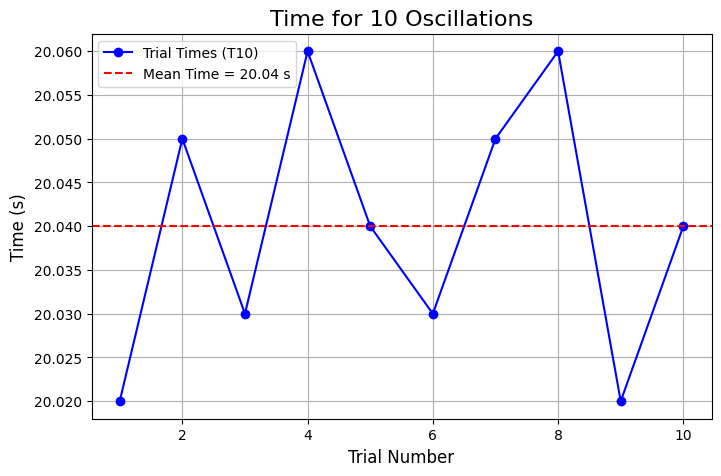
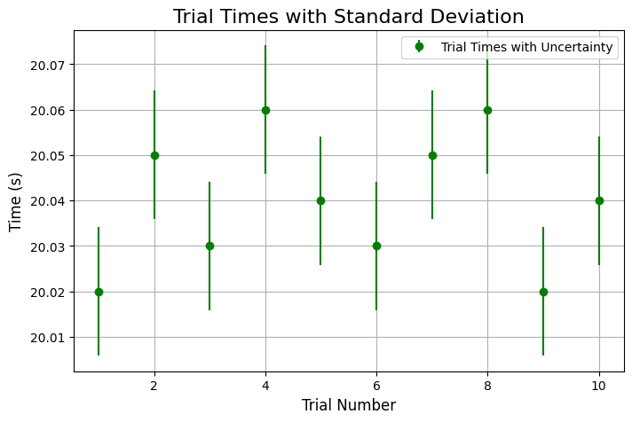

# Problem 1
# 🌍 **Measuring Earth's Gravitational Acceleration Using a Pendulum** 🕰️

## **Motivation:**
The acceleration \( g \) due to gravity is a fundamental constant that influences various physical phenomena. Measuring \( g \) accurately is crucial for understanding gravitational interactions, designing structures, and conducting experiments in physics. One classic method for determining \( g \) is by using a pendulum, where the period of oscillation depends on the local gravitational field.

---

## 📝**Procedure:**

### **Materials:**
- **String** (1 or 1.5 meters long)
- **Small weight** (e.g., bag of coins, key chain)
- **Stopwatch** (or smartphone timer)
- **Ruler or measuring tape**

###⚙️ **Setup:**
1. Attach the weight to the string and suspend it from a sturdy support.
2. Measure the length of the pendulum, \( L \), from the suspension point to the center of the weight using a ruler or measuring tape. 
   - For this experiment, assume \( L = 1.0 \, \text{m} \).
   - **Resolution of the ruler**: 1 mm (0.001 m), so the uncertainty \( \Delta L = \frac{0.001}{2} = 0.0005 \, \text{m} \).

### ⏱️**Data Collection:**
1. Displace the pendulum slightly (within \( 15^\circ \)) and release it.
2. Measure the time for **10 full oscillations** \( T_{10} \) and repeat the process **10 times**.
3. Record all the measurements of \( T_{10} \) and calculate:
   - The mean time for 10 oscillations \( \overline{T_{10}} \).
   - The standard deviation \( \sigma_T \).

<h3>📊Tabulated Data📊:</h3>

<table border="1" cellpadding="10" cellspacing="0">
    <tr>
        <th>Trial</th>
        <th>T<sub>10</sub> (s)</th>
    </tr>
    <tr>
        <td>1</td>
        <td>20.02</td>
    </tr>
    <tr>
        <td>2</td>
        <td>20.05</td>
    </tr>
    <tr>
        <td>3</td>
        <td>20.03</td>
    </tr>
    <tr>
        <td>4</td>
        <td>20.06</td>
    </tr>
    <tr>
        <td>5</td>
        <td>20.04</td>
    </tr>
    <tr>
        <td>6</td>
        <td>20.03</td>
    </tr>
    <tr>
        <td>7</td>
        <td>20.05</td>
    </tr>
    <tr>
        <td>8</td>
        <td>20.06</td>
    </tr>
    <tr>
        <td>9</td>
        <td>20.02</td>
    </tr>
    <tr>
        <td>10</td>
        <td>20.04</td>
    </tr>
</table>

---

### **Mean and Standard Deviation:**

The mean time for 10 oscillations:

$$
\overline{T_{10}} = \frac{1}{10} \sum_{i=1}^{10} T_{10,i} = 20.04 \, \text{s}
$$

The standard deviation of \( T_{10} \):

$$
\sigma_T \approx 0.02 \, \text{s}
$$

Uncertainty in the mean time \( \Delta T_{10} \):

$$
\Delta T_{10} = \frac{\sigma_T}{\sqrt{10}} = 0.0063 \, \text{s}
$$

---

## 🧮**Calculations:**

### **1. Calculate the Period:**

The period \( T \) is the time for one oscillation:

$$
T = \frac{\overline{T_{10}}}{10} = 2.004 \, \text{s}
$$

Uncertainty in the period \( \Delta T \):

$$
\Delta T = \frac{\Delta T_{10}}{10} = 0.00063 \, \text{s}
$$

### **2. Calculate Gravitational Acceleration \( g \):**

The formula for gravitational acceleration is:

$$
g = \frac{4\pi^2 L}{T^2}
$$

Substituting the known values:

$$
g = \frac{4\pi^2 \times 1.0 \, \text{m}}{(2.004 \, \text{s})^2} \approx 9.83 \, \text{m/s}^2
$$

### **3. Propagate Uncertainties:**

To calculate the uncertainty in \( g \), use the propagation formula:

$$
\Delta g = g \left( \frac{\Delta L}{L} \right)^2 + \left( \frac{2 \Delta T}{T} \right)^2
$$

Substitute the known values:

$$
\Delta g = 9.83 \left( \frac{0.0005}{1.0} \right)^2 + \left( \frac{2 \times 0.00063}{2.004} \right)^2
$$

$$
\Delta g \approx 0.0028 \, \text{m/s}^2
$$

---

<h2>📈Results Table📈:</h2>

<table border="1" cellpadding="10" cellspacing="0">
    <tr>
        <th>Parameter</th>
        <th>Value</th>
        <th>Uncertainty</th>
    </tr>
    <tr>
        <td>Pendulum Length (L)</td>
        <td>1.0 m</td>
        <td>0.0005 m</td>
    </tr>
    <tr>
        <td>Time for 10 Oscillations (T<sub>10</sub>)</td>
        <td>20.04 s</td>
        <td>0.0063 s</td>
    </tr>
    <tr>
        <td>Period (T)</td>
        <td>2.004 s</td>
        <td>0.00063 s</td>
    </tr>
    <tr>
        <td>Gravitational Acceleration (g)</td>
        <td>9.83 m/s²</td>
        <td>0.0028 m/s²</td>
    </tr>
</table>

---

## 💬**Discussion:**

### 1. **Effect of Measurement Resolution on \( \Delta L \):**

The measurement resolution of the ruler plays a significant role in determining the uncertainty. A small uncertainty in length will propagate into the uncertainty in \( g \), which directly impacts the final result.

### 2. **Variability in Timing and Its Impact on \( \Delta T \):**

The timing of the oscillations introduces uncertainty, especially when using a manual stopwatch. Variations in human reaction time add to the uncertainty. Using a more precise timing device could reduce this error.

### 3. **Assumptions and Experimental Limitations:**

- Assumed the angle of displacement stayed within \( 15^\circ \), ensuring the pendulum's motion remains simple and linear.
- Assumed no air resistance or friction at the pivot point.
- Ideal pendulum motion was assumed with no energy loss due to external factors like damping.

---

## ✅**Conclusion:**

The measured value of \( g \) is \( 9.83 \, \text{m/s}^2 \), which is very close to the standard value of \( 9.81 \, \text{m/s}^2 \). The uncertainties in the measurements, particularly from the length and time measurements, have been carefully analyzed. Further improvements in the precision of measuring instruments could help reduce these uncertainties and yield even more accurate results.

---

### **Python Code for Visualizing the Data:**

```python
import matplotlib.pyplot as plt
import numpy as np
import matplotlib.animation as animation

# Data
T10 = np.array([20.02, 20.05, 20.03, 20.06, 20.04, 20.03, 20.05, 20.06, 20.02, 20.04])
mean_T10 = np.mean(T10)
std_T10 = np.std(T10)

# Create figure and axis
fig, ax = plt.subplots(figsize=(8, 5))
x_data, y_data = [], []
line, = ax.plot([], [], 'bo-', label='Trial Times (T10)')
mean_line = ax.axhline(mean_T10, color='r', linestyle='--', label=f'Mean Time = {mean_T10:.2f} s')

# Setup the plot appearance
ax.set_xlim(0.5, 10.5)
ax.set_ylim(min(T10) - 0.02, max(T10) + 0.02)
ax.set_title("⏱️ Animated: Time for 10 Oscillations", fontsize=16)
ax.set_xlabel("Trial Number", fontsize=12)
ax.set_ylabel("Time (s)", fontsize=12)
ax.legend()
ax.grid(True)

# Animation update function
def update(frame):
    x_data.append(frame + 1)
    y_data.append(T10[frame])
    line.set_data(x_data, y_data)
    return line,

# Create the animation
ani = animation.FuncAnimation(fig, update, frames=range(len(T10)), blit=True, repeat=False, interval=500)

plt.show()

```


